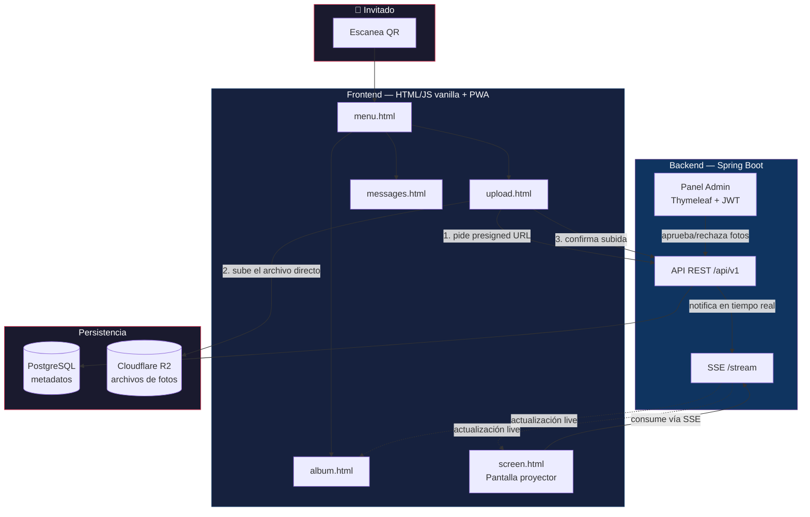
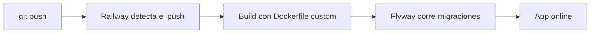

<div align="center">

# 📸 EventFoto

**Álbum digital colaborativo para eventos — escaneá un QR, subí tus fotos, y verlas aparecer en tiempo real en pantalla.**


</div>

---

## 📖 Tabla de contenidos

- [¿Qué es esto?](#-qué-es-esto)
- [Funcionalidades](#-funcionalidades)
- [Arquitectura](#-arquitectura)
- [Stack técnico](#-stack-técnico)
- [Estructura del proyecto](#-estructura-del-proyecto)
- [Cómo correr el proyecto localmente](#-cómo-correr-el-proyecto-localmente)
- [Variables de entorno](#-variables-de-entorno)
- [Endpoints principales de la API](#-endpoints-principales-de-la-api)
- [Despliegue](#-despliegue)
- [Roadmap](#-roadmap)
- [Problemas conocidos / notas de operación](#-problemas-conocidos--notas-de-operación)

---

## 🎉 ¿Qué es esto?

**EventFoto** es una aplicación web (PWA) que le permite a los invitados de un evento —boda, cumpleaños, evento corporativo— subir fotos desde su celular con solo escanear un código QR, sin necesidad de descargar ninguna app ni crear una cuenta. Las fotos aprobadas se muestran en tiempo real en una pantalla o proyector del salón, junto con los mensajes que los invitados dejan para el homenajeado.

Nace como el álbum digital para una boda real, con la idea de evolucionar hacia un producto que otros organizadores puedan usar para sus propios eventos.

## ✨ Funcionalidades

- 📷 **Subida de fotos sin fricción** — escaneás el QR, sacás la foto (o la elegís de la galería) y la subís, todo desde el navegador.
- 🖼️ **Álbum colaborativo** — todos los invitados ven las fotos de todos, paginado y optimizado para conexiones móviles.
- 💬 **Comentarios por foto** — cada foto admite comentarios de otros invitados.
- 💌 **Muro de mensajes** — un espacio separado del álbum, pensado para dejarle un mensaje al homenajeado.
- 📺 **Pantalla en vivo** — un carrusel a pantalla completa pensado para una TV/proyector en el salón, que se actualiza solo (sin recargar) vía Server-Sent Events apenas se aprueba una foto o llega un mensaje nuevo.
- ✅ **Moderación desde un panel de admin** — las fotos entran en estado pendiente y el organizador las aprueba (una por una o todas juntas) antes de que aparezcan en el álbum público y la pantalla.
- ⬇️ **Descarga de fotos** — los invitados pueden descargar las fotos del álbum.
- 🔄 **Conversión automática de HEIC a JPEG** — las fotos de iPhone se convierten en el backend para que se vean bien en cualquier dispositivo.
- 📲 **PWA instalable** — el invitado puede agregar el menú a su pantalla de inicio como si fuera una app nativa.

## 🏗️ Arquitectura



**Flujo de subida de foto (por qué no pasa por el backend):** el navegador del invitado sube el archivo **directo** a Cloudflare R2 usando una presigned URL generada por el backend — el archivo nunca transita por el servidor Spring Boot. Esto evita que el backend se sature con el peso de las imágenes durante los picos de subida del evento.

## 🛠️ Stack técnico

| Capa | Tecnología | Por qué |
|---|---|---|
| Backend | Spring Boot 3.x (Java 21) | API REST + lógica de negocio |
| Base de datos | PostgreSQL (Railway) | Metadatos de eventos, fotos, comentarios, mensajes |
| Migraciones | Flyway | Control de versiones del schema |
| Storage de archivos | Cloudflare R2 | Compatible con S3, sin costo de egress — clave para servir fotos repetidamente en la pantalla en vivo |
| Tiempo real | Server-Sent Events (SSE) | Actualización en vivo del álbum y la pantalla proyector |
| Autenticación admin | Spring Security + JWT | Panel de organizador protegido |
| Frontend invitados | HTML + CSS (Pico.css) + JS vanilla | Sin build tools, mobile-first, carga liviana |
| Panel admin | Thymeleaf | Renderizado server-side, sin JS pesado |
| Generación de QR | ZXing | QR apuntando al slug del evento |
| Conversión HEIC → JPEG | libheif (`heif-convert`) vía Docker | Alternativa gratuita a librerías Java comerciales |
| Despliegue | Railway | Backend + Postgres en la misma plataforma |

## 📁 Estructura del proyecto

Organizado **por feature**, no por capa técnica — cada carpeta agrupa todo lo necesario para esa funcionalidad (entidad, repositorio, service, controller, DTOs), para que agregar o modificar una funcionalidad no implique saltar entre múltiples carpetas.

```
src/main/java/com/tuapp/eventfoto/
├── event/              # Eventos (creación, datos del evento)
├── photo/              # Fotos, aprobación, upload
├── comment/            # Comentarios sobre fotos
├── message/            # Muro de mensajes al homenajeado
├── admin/              # Autenticación de admin (login JWT)
├── storage/            # Integración con Cloudflare R2 + conversión HEIC
├── realtime/           # Server-Sent Events
├── qr/                 # Generación de código QR (ZXing)
└── common/
    ├── config/         # SecurityConfig, configuración general
    └── exception/      # Manejo de errores centralizado
```

## 🚀 Cómo correr el proyecto localmente

### Prerrequisitos
- Java 21
- Maven
- PostgreSQL (local o vía Docker)
- Cuenta de Cloudflare con bucket R2 configurado ([ver guía](#variables-de-entorno))

### Pasos

```bash
# 1. Cloná el repo
git clone https://github.com/TU-USUARIO/app-fotos-evento.git
cd app-fotos-evento

# 2. Copiá el archivo de variables de entorno de ejemplo
cp .env.example .env
# Completá .env con tus credenciales reales (ver sección siguiente)

# 3. Levantá el proyecto
mvn spring-boot:run
```

La app queda disponible en `http://localhost:8080`.

### Probar desde el celular sin desplegar (con ngrok)

```bash
ngrok http 8080
```

Usá la URL HTTPS que te da ngrok para probar el flujo completo desde un dispositivo real — necesario para validar que el service worker de la PWA registra correctamente (requiere HTTPS).

## 🔐 Variables de entorno

| Variable | Descripción |
|---|---|
| `DB_URL` | URL JDBC de PostgreSQL (formato `jdbc:postgresql://host:puerto/db`, **sin** usuario/password embebidos) |
| `DB_USER` / `DB_PASSWORD` | Credenciales de la base |
| `R2_ACCESS_KEY` / `R2_SECRET_KEY` | Credenciales del API Token de Cloudflare R2 |
| `R2_BUCKET` | Nombre del bucket |
| `R2_ENDPOINT` | Endpoint S3 de tu cuenta de Cloudflare (`https://<account_id>.r2.cloudflarestorage.com`) |
| `ADMIN_EMAIL` / `ADMIN_PASSWORD` | Credenciales del organizador/admin |
| `JWT_SECRET` | Secreto para firmar los tokens JWT del panel admin |
| `APP_BASE_URL` | URL pública de la app (usada para generar el QR) |

> Ver `.env.example` en la raíz del repo para la plantilla completa.

## 🔌 Endpoints principales de la API

Todos bajo el prefijo `/api/v1`.

| Método | Ruta | Descripción | Auth |
|---|---|---|---|
| `GET` | `/events/{slug}` | Datos del evento | Pública |
| `POST` | `/events/{slug}/photos/upload-url` | Genera presigned URL para subir foto | Pública |
| `POST` | `/events/{slug}/photos/confirm` | Confirma subida y crea el registro | Pública |
| `GET` | `/events/{slug}/photos` | Lista fotos aprobadas (paginado) | Pública |
| `POST` | `/photos/{photoId}/comments` | Agrega un comentario | Pública |
| `POST` | `/events/{slug}/messages` | Deja un mensaje | Pública |
| `GET` | `/events/{slug}/stream` | Conexión SSE de tiempo real | Pública |
| `POST` | `/admin/auth/login` | Login del organizador | Pública |
| `PATCH` | `/admin/photos/{photoId}/approve` | Aprueba una foto | 🔒 ADMIN |
| `DELETE` | `/admin/photos/{photoId}` | Borra una foto (R2 + base) | 🔒 ADMIN |

## ☁️ Despliegue

Desplegado en **Railway** con un `Dockerfile` custom (necesario para instalar `libheif-examples`, requerido para la conversión HEIC → JPEG).



## 🗺️ Roadmap

- [x] Fase 0 — Setup inicial del proyecto
- [x] Fase 1 — Modelo de datos y entidades
- [x] Fase 2 — Integración con Cloudflare R2 + conversión HEIC
- [x] Fase 3 — Endpoints públicos (API REST)
- [x] Fase 4 — Tiempo real (SSE)
- [x] Fase 5 — Frontend de invitados
- [x] Fase 6 — Panel de administración (login + moderación)
- [x] Fase 7 — Deploy en Railway
- [ ] Fase 8 — Prueba de carga previa al evento
- [ ] Fase 9 — Evolución a SaaS multi-tenant

## ⚠️ Problemas conocidos / notas de operación

- Los registros de `Photo` **no se sincronizan automáticamente** si se borra un archivo directo desde el dashboard de Cloudflare — usar siempre el endpoint de borrado de la app (`DELETE /admin/photos/{photoId}`), que borra en ambos lados.
- El CORS del bucket de R2 debe restringirse al dominio de producción antes del evento real (actualmente puede estar en `*` para pruebas).
- `SecurityConfig` termina la cadena de reglas con `.anyRequest().permitAll()` — pendiente de revisar y endurecer a `.anyRequest().authenticated()`.

---

<div align="center">
<sub>Construido con Spring Boot, mucho debugging, y una boda real como caso de prueba 💍</sub>
</div>
