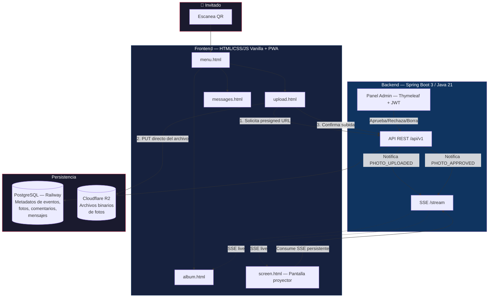
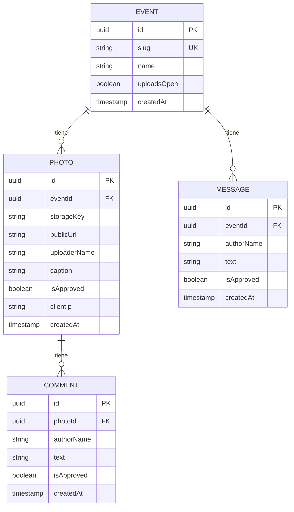
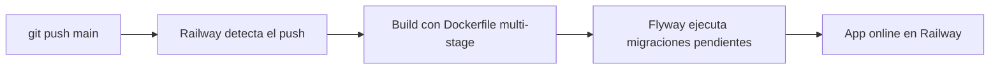

<div align="center">

# 💍 EventFoto — Boda de Marcos y Priscila

**Álbum digital colaborativo en tiempo real para eventos.**  
Los invitados escanean un QR, suben sus fotos desde el celular sin instalar nada, y las ven aparecer en la pantalla del salón al instante.


</div>

---

## 📖 Tabla de Contenidos

- [¿Qué es esto?](#-qué-es-esto)
- [Demo](#-demo)
- [Funcionalidades](#-funcionalidades)
- [Arquitectura del sistema](#-arquitectura-del-sistema)
- [Flujo de subida de una foto](#-flujo-de-subida-de-una-foto)
- [Flujo de tiempo real (SSE)](#-flujo-de-tiempo-real-sse)
- [Stack Técnico](#-stack-técnico)
- [Estructura del Proyecto](#-estructura-del-proyecto)
- [Modelo de Datos](#-modelo-de-datos)
- [API REST — Endpoints](#-api-rest--endpoints)
- [Panel de Administración](#-panel-de-administración)
- [Moderación de Contenido](#-moderación-de-contenido)
- [Rate Limiting](#-rate-limiting)
- [Código QR Dinámico](#-código-qr-dinámico)
- [Vistas del Frontend (Invitados)](#-vistas-del-frontend-invitados)
- [Pantalla del Salón](#-pantalla-del-salón)
- [Tipografía e Iconografía](#-tipografía-e-iconografía)
- [Cómo correr el proyecto localmente](#-cómo-correr-el-proyecto-localmente)
- [Variables de Entorno](#-variables-de-entorno)
- [Docker y Despliegue en Railway](#-docker-y-despliegue-en-railway)
- [Pruebas Automatizadas](#-pruebas-automatizadas)
- [Prueba de Carga Previa al Evento](#-prueba-de-carga-previa-al-evento)
- [Roadmap Completo](#-roadmap-completo)
- [Decisiones de Diseño y Notas de Operación](#-decisiones-de-diseño-y-notas-de-operación)

---

## 🎉 ¿Qué es esto?

**EventFoto** es una aplicación web progresiva (PWA) construida específicamente para la boda de **Marcos y Priscila**. Permite que los invitados suban fotos desde su celular simplemente escaneando un código QR —sin descargar ninguna app, sin registrarse, sin fricción.

Las fotos entran en un estado **pendiente de moderación** y el organizador (admin) las aprueba desde un panel privado. Las fotos aprobadas aparecen instantáneamente en el **álbum colaborativo** y en la **pantalla del salón** (conectada vía TV/proyector), todo actualizado en tiempo real gracias a Server-Sent Events.

Además del álbum, los invitados pueden:
- **Comentar** las fotos de otros.
- **Dejar mensajes** de felicitación para los novios en el Libro de Visitas.

El proyecto nació como un caso real de uso con la idea de evolucionar a un producto **multi-tenant** que cualquier organizador pueda usar para sus propios eventos (bodas, cumpleaños, eventos corporativos).

---

## 🌐 Demo

La aplicación está desplegada en producción en Railway:

| Vista | URL |
|---|---|
| **Menú de invitados** | `https://marcosypriscila-production.up.railway.app/menu.html` |
| **Álbum colaborativo** | `https://marcosypriscila-production.up.railway.app/album.html` |
| **Subida de fotos** | `https://marcosypriscila-production.up.railway.app/upload.html` |
| **Libro de Visitas** | `https://marcosypriscila-production.up.railway.app/messages.html` |
| **Pantalla del salón** | `https://marcosypriscila-production.up.railway.app/screen.html` |
| **Panel de Admin** | `https://marcosypriscila-production.up.railway.app/admin/login` |

---

## ✨ Funcionalidades

### Para los Invitados
- 📷 **Subida de fotos sin fricción** — Escaneás el QR en el salón, abrís el navegador, sacás o elegís la foto y la subís. Sin registro, sin app.
- 📱 **Soporte para iPhone (HEIC)** — Las fotos en formato HEIC/HEIF se convierten automáticamente a JPEG en el servidor para compatibilidad universal.
- 🖼️ **Álbum colaborativo** — Galería masonry con todas las fotos aprobadas del evento, paginada y optimizada para conexiones móviles.
- 💬 **Comentarios por foto** — Cada foto del álbum admite comentarios de otros invitados (los más recientes primero).
- 💌 **Libro de Visitas** — Un muro de mensajes de texto dedicado para que los invitados le dejen buenos deseos a los novios.
- 📲 **PWA instalable** — El menú se puede agregar a la pantalla de inicio del celular como una app nativa.

### Para el Organizador (Admin)
- 🔒 **Panel de administración** — Protegido con JWT. Acceso por usuario y contraseña.
- ✅ **Moderación de fotos** — Las fotos entran en estado *pendiente*. El admin las aprueba una por una, o todas a la vez con el botón "Aprobar Todas".
- ❌ **Rechazo con borrado inmediato (R2 + BD)** — Al rechazar una foto pendiente, se elimina inmediatamente del bucket Cloudflare R2 y de PostgreSQL, disparando la notificación SSE `PHOTO_REJECTED`.
- 📦 **Descarga del Álbum (ZIP streaming & Selección)** — En la pestaña *Fotos Guardadas*, el admin puede empaquetar y descargar el álbum completo o una selección personalizada de fotos aprobadas en un archivo ZIP por streaming directo (eficiente en memoria RAM). También admite descargas individuales presignadas (HTTP 302).
- 🗑️ **Borrado definitivo** — Elimina cualquier foto aprobada de R2 y de la base de datos en un solo clic.
- 💬 **Moderación de comentarios** — Panel dedicado con miniatura de la foto, nombre del autor y texto, con botón de borrado directo.
- 📨 **Moderación del Libro de Visitas** — Listado de mensajes con nombre de remitente y texto, con botón de borrado.
- 📺 **Control de subidas** — El admin puede cerrar/abrir las subidas de fotos desde el panel. Cuando están cerradas, los invitados ven un mensaje informativo.
- 🔄 **Tiempo real** — Las fotos aprobadas aparecen instantáneamente en la pantalla del salón y en el álbum de todos los invitados sin recargar la página.
- 📊 **Código QR dinámico** — El QR se genera en el servidor con la URL del evento; se puede descargar desde el panel de admin.

---

## 🏗️ Arquitectura del Sistema



---

## 📤 Flujo de Subida de una Foto

El flujo es **de tres pasos** para evitar que el backend se sature con el peso de las imágenes. Los archivos nunca pasan por el servidor Spring Boot:

```
Navegador del Invitado                    Backend Spring Boot              Cloudflare R2
        |                                        |                               |
        | --- POST /photos/upload-url ---------> |                               |
        |     { filename, contentType, fileSize }|                               |
        |                                        | --- Genera Presigned URL ---> |
        |                                        | <-- URL firmada + storageKey--|
        | <-- { uploadUrl, storageKey } ---------|                               |
        |                                        |                               |
        | --- PUT [uploadUrl] (bytes del archivo) --------------------------->   |
        | <-- 200 OK --------------------------------------------------------    |
        |                                        |                               |
        | --- POST /photos/confirm ------------> |                               |
        |     { storageKey, uploaderName, ... }  |                               |
        |                                        | Guarda Photo(isApproved=false)|
        |                                        | Emite SSE PHOTO_UPLOADED      |
        | <-- 201 Created (PhotoResponseDTO) ----|                               |
```

**¿Por qué presigned URL?**  
El bucket de Cloudflare R2 tiene una generosa capa gratuita y **no cobra egress** (tráfico saliente). Subir los archivos directamente desde el navegador del invitado a R2 evita saturar el servidor Spring Boot durante los picos de subida simultánea del evento.

---

## 📡 Flujo de Tiempo Real (SSE)

Cada navegador conectado abre una conexión HTTP persistente al endpoint `/api/v1/events/{slug}/stream`. El backend emite eventos en formato `text/event-stream` sin necesidad de WebSockets.

**Eventos emitidos:**

| Evento | Cuándo se emite |
|---|---|
| `PHOTO_UPLOADED` | Cuando un invitado sube una foto (estado pendiente) |
| `PHOTO_APPROVED` | Cuando el admin aprueba una foto |
| `PHOTO_DELETED` | Cuando el admin borra una foto |
| `MESSAGE_CREATED` | Cuando un invitado envía un mensaje al Libro de Visitas |
| `heartbeat` | Cada 25 segundos para mantener la conexión viva |

El `SseBroadcaster` mantiene un `ConcurrentHashMap<UUID, List<SseEmitter>>` de emisores por `eventId`. Cuando se emite un evento, itera sobre los emisores del evento correspondiente y envía el payload en JSON.

---

## 🛠️ Stack Técnico

| Capa | Tecnología | Versión | Motivo |
|---|---|---|---|
| **Backend** | Spring Boot | 3.3.2 | API REST, SSE, lógica de negocio |
| **Lenguaje** | Java | 21 (LTS) | Virtual threads listos para futuro, soporte extendido |
| **ORM / Persistencia** | Spring Data JPA + Hibernate | — | Acceso a datos tipado |
| **Base de Datos** | PostgreSQL | — | Metadatos de eventos, fotos, comentarios, mensajes |
| **Migraciones** | Flyway | — | Historial versionado del esquema de BD |
| **Almacenamiento de fotos** | Cloudflare R2 (API S3) | AWS SDK v2 | Sin costo de egress; compatible con S3 |
| **Tiempo real** | Server-Sent Events (SSE) | Spring MVC | Actualización unidireccional live sin WebSockets |
| **Autenticación admin** | Spring Security + JWT (jjwt) | 0.12.5 | Panel de organizador protegido |
| **Vistas admin** | Thymeleaf | — | Server-side rendering sin JS pesado en admin |
| **Frontend invitados** | HTML5 + CSS Vanilla + JS Vanilla | — | Sin build tools; carga liviana; mobile-first |
| **PWA** | Service Worker + Manifest | — | Instalable en pantalla de inicio del celular |
| **Código QR** | Google ZXing | 3.5.3 | Generación de QR apuntando al slug del evento |
| **Conversión HEIC→JPEG** | `libheif-examples` (binario nativo) | — | Convierte fotos de iPhone sin SDK comerciales |
| **Iconografía** | Font Awesome 6 Free (CDN) | 6.5.1 | Iconos vectoriales SVG consistentes en todos los dispositivos |
| **Tipografía** | Google Fonts (Playfair Display, Cormorant Garamond, Alex Brush, Plus Jakarta Sans) | — | Estética formal, delicada y elegante |
| **Despliegue** | Railway (Backend + Postgres) | — | CI/CD automático con cada push a `main` |
| **Contenedor** | Docker (multi-stage build) | — | Imagen mínima con libheif incluida |
| **Tests** | JUnit 5 + Spring Boot Test + H2 (in-memory) | — | 36 tests automatizados (unitarios + integración) |

---

## 📁 Estructura del Proyecto

El código está organizado **por feature** (no por capa técnica). Cada paquete contiene todo lo necesario para esa funcionalidad: entidad, repositorio, servicio, controlador y DTOs.

```
MarcosYpriscila/
├── Dockerfile                          # Multi-stage: Maven build + JRE runtime + libheif
├── docker-compose.yml                  # PostgreSQL local para desarrollo
├── pom.xml                             # Dependencias Maven
├── .env.example                        # Plantilla de variables de entorno
├── scripts/
│   └── load-test.js                    # Script de prueba de carga (Node.js, sin dependencias)
└── src/
    ├── main/
    │   ├── java/com/tuapp/eventfoto/
    │   │   ├── EventFotoApplication.java
    │   │   ├── event/                  # Eventos (entidad, repositorio, servicio, controlador)
    │   │   ├── photo/                  # Fotos: upload-url, confirm, approve, delete
    │   │   │   └── dto/               # UploadUrlRequestDTO, ConfirmUploadRequestDTO, PhotoResponseDTO
    │   │   ├── comment/               # Comentarios sobre fotos
    │   │   ├── message/               # Libro de Visitas (mensajes al homenajeado)
    │   │   ├── admin/                 # Autenticación del organizador (login JWT)
    │   │   ├── storage/               # Integración Cloudflare R2 + conversión HEIC
    │   │   ├── realtime/              # SSE: SseBroadcaster, RealtimeController
    │   │   ├── qr/                    # Generación de código QR con ZXing
    │   │   └── common/
    │   │       ├── config/            # SecurityConfig, JwtTokenProvider, RateLimiterService, S3Config
    │   │       ├── exception/         # GlobalExceptionHandler + excepciones tipadas
    │   │       └── moderation/        # ContentModerationService + diccionario de palabras bloqueadas
    │   └── resources/
    │       ├── application.yml         # Configuración de la aplicación
    │       ├── db/migration/          # Scripts SQL de Flyway (V1–V4)
    │       ├── moderation/
    │       │   └── blocked-words-es.txt  # Diccionario de palabras bloqueadas (43 palabras, editable)
    │       ├── static/                # Frontend invitados (HTML/CSS/JS)
    │       │   ├── index.html         # Redirect a menu.html
    │       │   ├── menu.html          # Menú principal de invitados
    │       │   ├── upload.html        # Subida de fotos
    │       │   ├── album.html         # Galería colaborativa
    │       │   ├── messages.html      # Libro de Visitas
    │       │   ├── screen.html        # Pantalla del salón (TV/proyector)
    │       │   ├── css/theme.css      # Design tokens y estilos globales
    │       │   └── images/            # Imagen de fondo y assets
    │       └── templates/admin/
    │           ├── login.html         # Página de login del admin
    │           └── dashboard.html     # Panel de administración (4 tabs)
    └── test/
        └── java/com/tuapp/eventfoto/
            ├── admin/AdminSecurityTest.java
            ├── api/PublicApiIntegrationTest.java
            ├── common/moderation/ContentModerationServiceTest.java
            ├── qr/QrCodeTest.java
            ├── realtime/RealtimeIntegrationTest.java
            └── storage/StorageServiceTest.java
```

---

## 🗄️ Modelo de Datos

Cuatro entidades principales, gestionadas con Flyway:



**Migraciones Flyway:**

| Archivo | Descripción |
|---|---|
| `V1__create_event.sql` | Tabla `event` con `slug` único e índice |
| `V2__create_photo.sql` | Tabla `photo` con FK a `event`, índices en `eventId` e `isApproved` |
| `V3__create_comment.sql` | Tabla `comment` con FK a `photo`, índices en `photoId` |
| `V4__create_message.sql` | Tabla `message` con FK a `event`, índices en `eventId` |

---

## 🔌 API REST — Endpoints

Todos los endpoints públicos están bajo el prefijo `/api/v1`. Los de administración están bajo `/api/v1/admin` y requieren JWT.

### Endpoints Públicos

| Método | Ruta | Descripción | Body/Params |
|---|---|---|---|
| `GET` | `/api/v1/events/{slug}` | Datos del evento (nombre, estado de subidas) | — |
| `GET` | `/api/v1/events/{slug}/qr` | Genera y devuelve el código QR como PNG | `?size=400` |
| `POST` | `/api/v1/events/{slug}/photos/upload-url` | Genera presigned URL para subida directa a R2 | `{ filename, contentType, fileSize }` |
| `POST` | `/api/v1/events/{slug}/photos/confirm` | Confirma que la subida a R2 fue exitosa | `{ storageKey, uploaderName, caption }` |
| `POST` | `/api/v1/events/{slug}/photos/upload-direct` | Subida multipart directa al servidor (fallback) | `multipart/form-data` |
| `GET` | `/api/v1/events/{slug}/photos` | Lista fotos aprobadas (paginado) | `?page=0&size=20` |
| `GET` | `/api/v1/events/{slug}/photos/{photoId}/comments` | Comentarios de una foto (más recientes primero) | — |
| `POST` | `/api/v1/events/{slug}/photos/{photoId}/comments` | Agrega un comentario a una foto | `{ authorName, text }` |
| `GET` | `/api/v1/events/{slug}/messages` | Lista mensajes del Libro de Visitas (paginado) | `?page=0&size=100` |
| `POST` | `/api/v1/events/{slug}/messages` | Envía un mensaje al Libro de Visitas | `{ authorName, text }` |
| `GET` | `/api/v1/events/{slug}/stream` | Conexión SSE de tiempo real | — |

### Endpoints de Administración (requieren JWT Bearer Token)

| Método | Ruta | Descripción |
|---|---|---|
| `POST` | `/api/v1/admin/auth/login` | Login del organizador → devuelve JWT |
| `GET` | `/api/v1/admin/photos/pending` | Lista fotos pendientes de aprobación |
| `PATCH` | `/api/v1/admin/photos/{photoId}/approve` | Aprueba una foto |
| `POST` | `/api/v1/admin/photos/approve-all` | Aprueba todas las fotos pendientes |
| `DELETE` / `PATCH` | `/api/v1/admin/photos/{photoId}/reject` | Rechaza y elimina una foto de R2 y de la base de datos |
| `GET` | `/api/v1/admin/photos/{photoId}/download` | Genera presigned URL de lectura y redirige (HTTP 302) |
| `GET` | `/api/v1/admin/photos/download-zip` | Genera y transmite en ZIP streaming el álbum completo o selección (`?photoIds=...`) |
| `GET` | `/api/v1/admin/comments/all` | Lista todos los comentarios de fotos |
| `DELETE` | `/api/v1/admin/comments/{commentId}` | Borra un comentario |
| `GET` | `/api/v1/admin/messages/all` | Lista todos los mensajes del Libro de Visitas |
| `DELETE` | `/api/v1/admin/messages/{messageId}` | Borra un mensaje |
| `PATCH` | `/api/v1/admin/events/{slug}/toggle-uploads` | Abre o cierra las subidas de fotos |

### Formato de errores

Todos los errores tienen el mismo formato JSON consistente:

```json
{
  "status": 429,
  "error": "Rate Limit Exceeded",
  "message": "Has superado el límite de 30 solicitudes de Presigned URL por minuto."
}
```

**Excepciones tipadas disponibles:** `ResourceNotFoundException` (404), `RateLimitExceededException` (429), `ContentModerationException` (400), `InvalidFileFormatException` (400), `MaxUploadLimitReachedException` (429), `EventClosedException` (403), `UnauthorizedAccessException` (401), `StorageException` (500).

---

## 🖥️ Panel de Administración

El panel `/admin/dashboard` es una página Thymeleaf renderizada server-side, accesible solo con JWT válido. Tiene **4 pestañas**:

1. **📷 Fotos Pendientes** — Previsualización de cada foto pendiente con botones de aprobar/rechazar. Botón "Aprobar Todas" para procesar en bloque.
2. **🖼️ Álbum Aprobado** — Galería de fotos aprobadas con botón de borrado individual.
3. **📨 Libro de Visitas** — Listado de mensajes con nombre de autor, texto y botón de borrado.
4. **💬 Comentarios en Fotos** — Listado de comentarios con miniatura de la foto correspondiente, nombre del autor, texto del comentario y botón de borrado.

El login genera un **JWT de 8 horas** almacenado en el navegador del admin. La sesión expira automáticamente pasadas las 8 horas.

---

## 🛡️ Moderación de Contenido

Los mensajes del Libro de Visitas y los comentarios de fotos pasan por un filtro automático **antes** de guardarse en la base de datos.

El `ContentModerationService` carga en memoria al arranque un diccionario de palabras bloqueadas desde:

```
src/main/resources/moderation/blocked-words-es.txt
```

El archivo tiene **43 palabras bloqueadas** (una por línea) y se puede editar sin tocar código. La comparación es **case-insensitive** y **normaliza acentos** (por ejemplo, "ofénsiva" y "ofensiva" se detectan igual).

Si el texto contiene alguna palabra bloqueada, el servidor devuelve un error `400 Bad Request` con un mensaje de contenido inapropiado.

Las **fotos** no pasan por este filtro automático — ingresan en estado `isApproved = false` y el admin las aprueba manualmente.

---

## 🚦 Rate Limiting

El `RateLimiterService` implementa un **sliding window counter** (ventana deslizante de 1 minuto) por dirección IP para proteger los endpoints más sensibles.

| Acción | Límite | Razón |
|---|---|---|
| Solicitud de Presigned URL (`upload-url`) | **30 por minuto por IP** | Permite que grupos en el mismo WiFi del salón suban fotos sin ser bloqueados |
| Comentarios y Mensajes | **15 por minuto por IP** | Previene spam masivo |

> **Nota importante:** En una boda, varios invitados en la misma red WiFi del salón comparten la misma IP pública de salida. Los límites están calibrados para este escenario real.

Si el límite se supera, el servidor responde con HTTP **429 Too Many Requests**.

---

## 📲 Código QR Dinámico

El QR se genera en el servidor con la biblioteca **Google ZXing**. La URL que encapsula apunta siempre al menú del evento:

```
GET /api/v1/events/{slug}/qr?size=400
→ Devuelve: image/png (bytes del QR)
→ URL codificada: https://{APP_BASE_URL}/menu.html?slug={slug}
```

El admin puede descargarlo desde el dashboard. En la `screen.html` (pantalla del salón), el QR aparece como una tarjeta flotante en el lado derecho de la pantalla, centrada verticalmente, con la leyenda *"Escaneá el QR y subí tu foto"*.

---

## 📱 Vistas del Frontend (Invitados)

Todas las vistas son HTML/CSS/JS vanilla — sin frameworks, sin build tools. Se cargan rápido en conexiones móviles lentas.

### `menu.html` — Menú Principal
La puerta de entrada. Monograma *"M & P"* en caligrafía cursiva (Alex Brush). Cuatro botones:
- **Subí tu foto** → `upload.html`
- **Ver el álbum** → `album.html`
- **Libro de visitas** → `messages.html`
- **Instalá la app** (PWA install prompt)

### `upload.html` — Subida de Fotos
Permite elegir la fuente de la foto (cámara, galería o archivo). Implementa el flujo de tres pasos (upload-url → PUT → confirm) con barra de progreso y mensajes de estado. Si el admin cerró las subidas, muestra un aviso informativo en lugar del formulario.

### `album.html` — Álbum Colaborativo
Galería masonry de fotos aprobadas. Al hacer clic en una foto se abre un modal con:
- La foto ampliada (descargable).
- El nombre del autor y la fecha.
- La lista de comentarios (más reciente primero) con scroll propio.
- El formulario para comentar **en la parte superior** de la lista (fijo, no desaparece al scrollear).
- El formulario de comentario no tiene botón de borrado — esa acción es exclusiva del admin.

Se conecta al endpoint SSE para actualizar la galería en tiempo real cuando se aprueba una nueva foto.

### `messages.html` — Libro de Visitas
Formulario para dejar un mensaje con nombre y texto. Lista de mensajes con el nombre del invitado, su mensaje y la hora de envío. Los mensajes nuevos llegan en tiempo real.

---

## 📺 Pantalla del Salón

`screen.html` es una vista a pantalla completa diseñada para una **TV o proyector del salón**. Características:

- **Carrusel automático de fotos** — Transición suave entre fotos aprobadas, con la duración configurable.
- **Zócalo deslizante de mensajes** — Una banda inferior que muestra en loop los mensajes del Libro de Visitas (tipo ticker de noticias).
- **Tarjeta QR flotante** — Verticalmente centrada en el lado derecho de la pantalla con la leyenda *"Escaneá el QR y subí tu foto"*.
- **Actualización automática** — Sin recargar la página. Cuando el admin aprueba una foto, aparece en la pantalla del salón en segundos gracias a la conexión SSE.

---

## 🎨 Tipografía e Iconografía

El diseño visual sigue una estética **formal, delicada y elegante**, coherente con el contexto de una boda.

**Fuentes (Google Fonts):**
| Rol | Fuente |
|---|---|
| Títulos y encabezados | **Playfair Display** + **Cormorant Garamond** (serif editorial) |
| Monograma M & P | **Alex Brush** (caligrafía cursiva) |
| Textos de interfaz y UI | **Plus Jakarta Sans** / **Outfit** |

**Iconos (Font Awesome 6 Free — CDN):**  
Todos los emojis del sistema operativo fueron reemplazados por iconos vectoriales SVG de Font Awesome 6 para garantizar consistencia visual en cualquier dispositivo (Android, iOS, Smart TV):

`fa-gem`, `fa-camera-retro`, `fa-images`, `fa-book-open-reader`, `fa-comments`, `fa-qrcode`, `fa-desktop`, `fa-pen-nib`, `fa-heart`, `fa-arrow-left`, `fa-trash`, `fa-check`, `fa-clock`, etc.

**Paleta de colores:**
- Fondo: Gradiente `#340912` → `#140307` (borgoña profundo oscuro)
- Primario: `#8c2b3e` (borgoña)
- Acento dorado: `#e6c594`
- Texto principal: `#fdf6f7` (blanco cálido)
- Texto secundario: `#e2c2c6` (rosa pálido)

---

## 🚀 Cómo Correr el Proyecto Localmente

### Prerrequisitos

- Java 21
- Maven 3.9+
- PostgreSQL 14+ (local o con Docker)
- Una cuenta de Cloudflare con bucket R2 configurado (opcional — en modo `local` las fotos se guardan en disco)

### 1. Clonar el repositorio

```bash
git clone https://github.com/CristianBurgi/MarcosYpriscila.git
cd MarcosYpriscila
```

### 2. Configurar las variables de entorno

```bash
cp .env.example .env
# Editá .env con tus credenciales reales
```

### 3. Levantar PostgreSQL con Docker (opcional)

```bash
docker-compose up -d
```

El `docker-compose.yml` levanta un PostgreSQL en `localhost:5433` con la base `eventfoto_db`.

### 4. Inicializar los datos de prueba

Al iniciar, el `DataInitializer` crea automáticamente el evento `marcos-y-priscila` si no existe en la base de datos.

### 5. Ejecutar la aplicación

```bash
mvn spring-boot:run
```

La app queda disponible en `http://localhost:8080`.

### 6. Modo de almacenamiento local vs. R2

Controlado por la variable `STORAGE_MODE` en `.env`:

| Valor | Comportamiento |
|---|---|
| `local` (por defecto) | Las fotos se guardan en `./uploads/` en el disco local. Útil para desarrollo sin credenciales de Cloudflare. |
| `r2` | Las fotos se suben a Cloudflare R2. Requiere `R2_ACCESS_KEY`, `R2_SECRET_KEY`, `R2_BUCKET` y `R2_ENDPOINT`. |

### 7. Probar desde el celular (con ngrok)

Para validar el flujo completo desde un dispositivo móvil real y probar la PWA (requiere HTTPS):

```bash
ngrok http 8080
# Usá la URL HTTPS que te da ngrok en el celular
```

---

## 🔐 Variables de Entorno

Todas las variables sensibles se cargan desde un archivo `.env` en la raíz gracias a la dependencia `spring-dotenv`.

| Variable | Descripción | Requerida en Prod |
|---|---|---|
| `DB_URL` | URL JDBC de PostgreSQL (`jdbc:postgresql://host:puerto/db`) | ✅ |
| `DB_USER` | Usuario de la base de datos | ✅ |
| `DB_PASSWORD` | Contraseña de la base de datos | ✅ |
| `STORAGE_MODE` | `r2` para producción, `local` para desarrollo | ✅ |
| `R2_ACCESS_KEY` | Access Key ID del API Token de Cloudflare R2 | ✅ (si `STORAGE_MODE=r2`) |
| `R2_SECRET_KEY` | Secret Access Key de Cloudflare R2 | ✅ (si `STORAGE_MODE=r2`) |
| `R2_BUCKET` | Nombre del bucket de R2 | ✅ |
| `R2_ENDPOINT` | Endpoint S3 de Cloudflare (`https://<account_id>.r2.cloudflarestorage.com`) | ✅ |
| `R2_PUBLIC_URL` | URL pública del bucket (si está habilitado acceso público en R2) | Opcional |
| `ADMIN_EMAIL` | Email de login del organizador | ✅ |
| `ADMIN_PASSWORD` | Contraseña del organizador | ✅ |
| `JWT_SECRET` | Secreto para firmar tokens JWT (mínimo 32 caracteres) | ✅ |
| `JWT_EXPIRATION_MS` | Duración del JWT en ms (por defecto 8 horas = `28800000`) | Opcional |
| `APP_BASE_URL` | URL pública de la app (usada para generar el QR) | ✅ |
| `PORT` | Puerto del servidor (Railway lo setea automáticamente) | Railway auto |

> Ver [`.env.example`](.env.example) para la plantilla completa.

---

## 🐳 Docker y Despliegue en Railway

### Dockerfile (multi-stage)

El build es de **dos etapas** para mantener la imagen final mínima:

```dockerfile
# Etapa 1: Compilación con Maven + JDK 21
FROM maven:3.9.8-eclipse-temurin-21 AS build
WORKDIR /app
COPY pom.xml .
COPY src src
RUN mvn clean package -DskipTests

# Etapa 2: Runtime mínimo + libheif para conversión HEIC
FROM eclipse-temurin:21-jre-jammy
RUN apt-get update && apt-get install -y --no-install-recommends libheif-examples
COPY --from=build /app/target/*.jar app.jar
EXPOSE 8080
ENTRYPOINT ["java", "-jar", "app.jar"]
```

> **¿Por qué `libheif-examples`?** Los iPhones guardan las fotos en formato HEIC/HEIF. El binario `heif-convert` (incluido en este paquete) permite convertirlas a JPEG en el servidor, sin necesidad de SDK comerciales.

### Despliegue en Railway



Railway conecta automáticamente el servicio de PostgreSQL mediante variables de entorno (`DATABASE_URL`, `PGHOST`, etc.) que se inyectan en el contenedor.

**Recomendación para el evento real:** Usar el plan **Hobby ($5/mes)** de Railway en lugar del plan gratuito, para evitar que el contenedor entre en modo *sleep* durante períodos de inactividad. Un contenedor en sleep añade 5-10 segundos de demora a la primera request.

---

## 🧪 Pruebas Automatizadas

El proyecto cuenta con **40 tests** que cubren las áreas críticas:

```bash
mvn test
```

| Suite | Tests | Qué verifica |
|---|---|---|
| `AdminSecurityTest` | 11 | Acceso protegido a rutas admin, JWT, aprobación/rechazo de fotos (R2 + BD), descargas 302 y ZIP streaming |
| `PublicApiIntegrationTest` | 12 | Flujo completo de subida (upload-url → confirm), consulta de fotos, comentarios, mensajes |
| `ContentModerationServiceTest` | 6 | Detección de palabras bloqueadas, normalización de acentos, case-insensitive, textos limpios |
| `QrCodeTest` | 3 | Generación del PNG de QR con URL correcta y dimensiones esperadas |
| `RealtimeIntegrationTest` | 2 | Suscripción SSE, emisión de eventos `PHOTO_APPROVED` y `MESSAGE_CREATED` |
| `StorageServiceTest` | 6 | Generación de presigned URLs de subida/descarga, borrado en R2, rechazo de tipos no permitidos |

Los tests de integración usan **H2 en memoria** (no necesitan PostgreSQL ni R2 reales). Los tests de storage usan mocks para evitar conexiones externas.

---

## 🔥 Prueba de Carga Previa al Evento

El script `scripts/load-test.js` simula el pico de actividad de los invitados durante la boda:

```bash
# Contra producción en Railway
node scripts/load-test.js https://marcosypriscila-production.up.railway.app 25

# Contra un servidor local
node scripts/load-test.js http://localhost:8080 30
```

**No requiere dependencias externas** — solo Node.js 16+.

El script simula **simultáneamente**:
1. N conexiones SSE persistentes (clientes escuchando el stream en tiempo real).
2. N flujos completos de subida de foto (upload-url → PUT → confirm).

**Resultados de la prueba real (25 usuarios simultáneos):**

| Métrica | Resultado |
|---|---|
| Conexiones SSE exitosas | 25/25 (100%) |
| Fotos confirmadas en BD | 25/25 (100%) |
| Tiempo mínimo de subida | 931 ms |
| Tiempo promedio de subida | 1,313 ms |
| Percentil 95 (P95) | 1,581 ms |
| Duración total del test | 7.62 s |

**Checklist previo al evento real:**
- [ ] Correr `node scripts/load-test.js [URL-PRODUCCION] 30` al menos **una semana antes** del evento.
- [ ] Verificar que todas las conexiones SSE se establezcan sin errores 500.
- [ ] Verificar que las fotos se confirmen con latencias menores a 3 segundos (P95).
- [ ] Probar el flujo completo desde un celular con **datos móviles** (no solo WiFi) para confirmar que los certificados SSL responden.
- [ ] Confirmar que el plan de Railway es pago (no free) para evitar cold starts.

---

## 🗺️ Roadmap Completo

| Fase | Estado | Descripción |
|---|---|---|
| **Fase 0** | ✅ Completado | Setup inicial del proyecto Spring Boot + estructura de paquetes |
| **Fase 1** | ✅ Completado | Modelo de datos: entidades JPA + migraciones Flyway V1–V4 |
| **Fase 2** | ✅ Completado | Integración Cloudflare R2 (presigned URLs) + conversión HEIC→JPEG |
| **Fase 3** | ✅ Completado | API REST pública: upload-url, confirm, fotos aprobadas, comentarios, mensajes |
| **Fase 4** | ✅ Completado | Tiempo real: SseBroadcaster + Server-Sent Events |
| **Fase 5** | ✅ Completado | Frontend de invitados: menu, upload, album, messages (HTML/CSS/JS vanilla, PWA) |
| **Fase 5b** | ✅ Completado | Panel de administración: login JWT, dashboard con 4 tabs, moderación de fotos/comentarios/mensajes |
| **Fase 5c** | ✅ Completado | Moderación automática de contenido (filtro de palabras bloqueadas) + Rate Limiting por IP |
| **Fase 5d** | ✅ Completado | Descarga de fotos exclusiva para organizador: Presigned GET (HTTP 302) + ZIP streaming masivo/selección |
| **Fase 6** | ✅ Completado | Pantalla del salón (`screen.html`): carrusel, zócalo de mensajes, tarjeta QR flotante |
| **Fase 6 Fix** | ✅ Completado | Rechazo con borrado inmediato y coordinado en Cloudflare R2 y PostgreSQL + notificaciones SSE |
| **Fase 7** | ✅ Completado | Despliegue en Railway con Dockerfile multi-stage |
| **Fase 7b** | ✅ Completado | Diseño final: tipografía Playfair Display/Alex Brush + iconografía Font Awesome 6 |
| **Fase 8** | ✅ Completado | Prueba de carga previa al evento: script `load-test.js` + ajuste de rate limits |
| **Fase 9** | 🔜 Pendiente | Evolución a SaaS multi-tenant: panel de creación de eventos, múltiples organizadores |

---

## ⚠️ Decisiones de Diseño y Notas de Operación

### Borrado de fotos
Siempre usar el endpoint de borrado de la app (`DELETE /api/v1/admin/photos/{photoId}`). Este endpoint borra el registro en la BD **y** el archivo en R2. Si se borra directamente desde el dashboard de Cloudflare, el registro huérfano queda en la BD y puede generar errores en el álbum.

### CORS del bucket R2
Para las pruebas, el bucket de R2 puede tener CORS configurado con `*`. **Antes del evento real**, restringir la política CORS del bucket solo al dominio de producción:

```json
[{
  "AllowedOrigins": ["https://marcosypriscila-production.up.railway.app"],
  "AllowedMethods": ["PUT"],
  "AllowedHeaders": ["Content-Type"]
}]
```

### Seguridad
El `SecurityConfig` actualmente termina con `.anyRequest().permitAll()` para facilitar el desarrollo. Para producción, considerar endurecer a `.anyRequest().authenticated()` con las excepciones necesarias para las rutas públicas.

### Conversión HEIC
La conversión HEIC→JPEG se realiza llamando al binario `heif-convert` instalado en el contenedor Docker. Si el invitado sube un HEIC y el binario no está disponible (por ejemplo, en un entorno de desarrollo sin Docker), el servicio devuelve un error 500. En local, usar `STORAGE_MODE=local` con fotos en formato JPEG/PNG para evitar este problema.

### Capacidad de Cloudflare R2 (plan gratuito)
- Almacenamiento: 10 GB gratuitos
- Operaciones de escritura: 1,000,000/mes gratuitas
- **Egress: gratuito** (sin costo por servir las fotos desde R2)

Para una boda de ~200 invitados subiendo 3 fotos c/u = ~600 fotos × ~3 MB promedio = ~1.8 GB. El plan gratuito es más que suficiente para un evento de este tamaño.

---

<div align="center">
<sub>Construido con Spring Boot, mucho debugging, y una boda real como caso de prueba 💍<br>
<em>Marcos y Priscila — 2026</em></sub>
</div>
