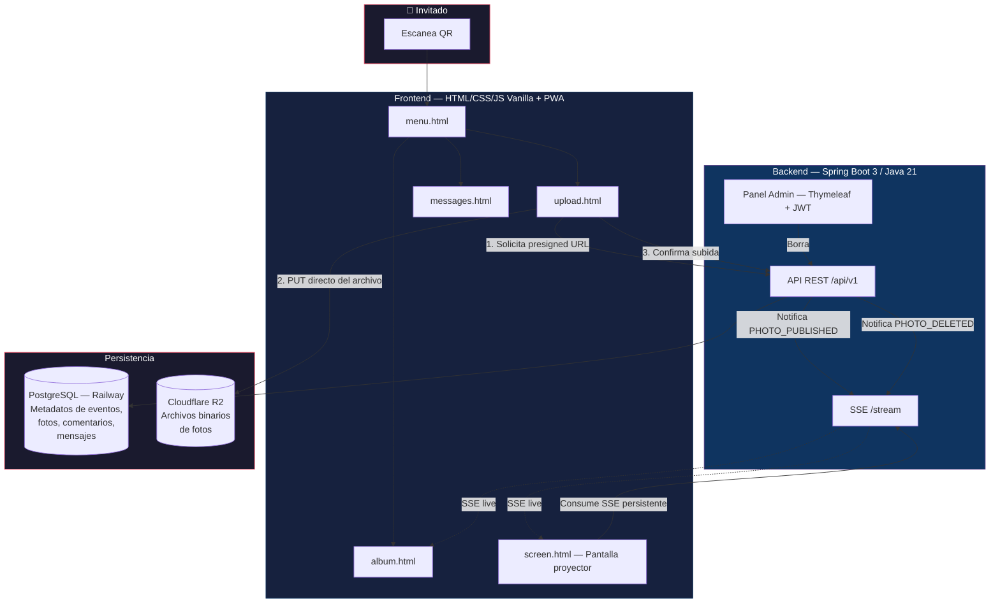
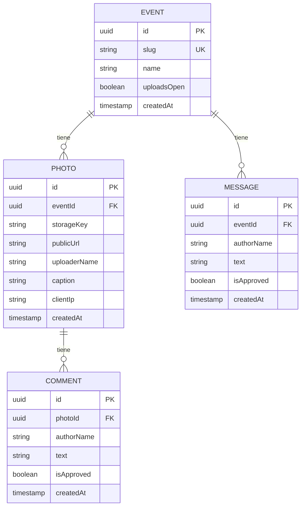
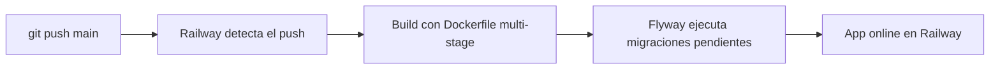

<div align="center">

# 📸 EventFoto

**Álbum digital colaborativo en tiempo real para eventos.**  
Los invitados escanean un QR, suben sus fotos desde el celular sin instalar nada, y las ven aparecer en la pantalla del salón al instante.


</div>

---

## 📖 Tabla de Contenidos

- [¿Qué es esto?](#-qué-es-esto)
- [Demo](#-demo)
- [Funcionalidades](#-funcionalidades)
- [Arquitectura del sistema](#-arquitectura-del-sistema)
- [Flujo de subida de una foto](#-flujo-de-subida-de-una-foto)
- [Flujo de tiempo real (SSE)](#-flujo-de-tiempo-real-sse)
- [Stack Técnico](#-stack-técnico)
- [Estructura del Proyecto](#-estructura-del-proyecto)
- [Modelo de Datos](#-modelo-de-datos)
- [API REST — Endpoints](#-api-rest--endpoints)
- [Panel de Administración](#-panel-de-administración)
- [Moderación de Contenido](#-moderación-de-contenido)
- [Rate Limiting](#-rate-limiting)
- [Código QR Dinámico](#-código-qr-dinámico)
- [Vistas del Frontend (Invitados)](#-vistas-del-frontend-invitados)
- [Pantalla del Salón](#-pantalla-del-salón)
- [Tipografía e Iconografía](#-tipografía-e-iconografía)
- [Cómo correr el proyecto localmente](#-cómo-correr-el-proyecto-localmente)
- [Variables de Entorno](#-variables-de-entorno)
- [Docker y Despliegue en Railway](#-docker-y-despliegue-en-railway)
- [Monitoreo de Errores (Sentry)](#-monitoreo-de-errores-sentry)
- [Integración Continua (CI)](#-integración-continua-ci)
- [Pruebas Automatizadas](#-pruebas-automatizadas)
- [Prueba de Carga Previa al Evento](#-prueba-de-carga-previa-al-evento)
- [Roadmap Completo](#-roadmap-completo)
- [Decisiones de Diseño y Notas de Operación](#-decisiones-de-diseño-y-notas-de-operación)

---

## 🎉 ¿Qué es esto?

**EventFoto** es una aplicación web progresiva (PWA) para eventos (bodas, cumpleaños, encuentros corporativos). Permite que los invitados suban fotos desde su celular simplemente escaneando un código QR —sin descargar ninguna app, sin registrarse, sin fricción.

Las fotos se **publican al instante**: apenas se confirma la subida aparecen en el **álbum colaborativo** y en la **pantalla del salón** (conectada vía TV/proyector), todo actualizado en tiempo real gracias a Server-Sent Events. El organizador modera desde un panel privado borrando lo que no corresponda.

Además del álbum, los invitados pueden:
- **Comentar** las fotos de otros.
- **Dejar mensajes** de felicitación para los anfitriones en el Libro de Visitas.

El proyecto nació como un caso real de uso con la idea de evolucionar a un producto **multi-tenant** que cualquier organizador pueda usar para sus propios eventos (bodas, cumpleaños, eventos corporativos).

---

## 🌐 Demo

La aplicación está desplegada en producción en Railway:

| Vista | URL |
|---|---|
| **Menú de invitados** | `https://tu-dominio.up.railway.app/e/{slug}` |
| **Álbum colaborativo** | `https://tu-dominio.up.railway.app/e/{slug}/album` |
| **Subida de fotos** | `https://tu-dominio.up.railway.app/e/{slug}/subir` |
| **Libro de Visitas** | `https://tu-dominio.up.railway.app/e/{slug}/mensajes` |
| **Pantalla del salón** | `https://tu-dominio.up.railway.app/e/{slug}/pantalla` |
| **Demo en vivo** | `https://tu-dominio.up.railway.app/demo` |
| **Panel del organizador** | `https://tu-dominio.up.railway.app/admin/login` → `/admin/eventos` (Mis eventos) → `/admin/eventos/{slug}` |

---

## ✨ Funcionalidades

### Para los Invitados
- 📷 **Subida de fotos sin fricción** — Escaneás el QR en el salón, abrís el navegador, sacás o elegís la foto y la subís. Sin registro, sin app.
- 📱 **Soporte para iPhone (HEIC)** — Las fotos en formato HEIC/HEIF se convierten automáticamente a JPEG en el servidor para compatibilidad universal.
- 🖼️ **Álbum colaborativo** — Galería masonry con todas las fotos del evento, paginada y optimizada para conexiones móviles.
- 💬 **Comentarios por foto** — Cada foto del álbum admite comentarios de otros invitados (los más recientes primero).
- 💌 **Libro de Visitas** — Un muro de mensajes de texto dedicado para que los invitados dejen buenos deseos.
- 📲 **PWA instalable** — El menú se puede agregar a la pantalla de inicio del celular como una app nativa.

### Para el Organizador (Admin)
- 🔒 **Panel de administración** — Protegido con JWT. Acceso por usuario y contraseña.
- ✅ **Publicación automática** — Las fotos se publican apenas se confirma la subida, sin paso de aprobación (Fase 9.0).
- 🗑️ **Borrado como moderación (R2 + BD)** — El único control de moderación de fotos: elimina la foto primero de Cloudflare R2 y después de PostgreSQL, y emite `PHOTO_DELETED` por SSE para que el álbum y la pantalla la saquen al instante.
- 📦 **Descarga del Álbum (ZIP streaming & Selección)** — En la pestaña *Fotos*, el admin puede empaquetar y descargar el álbum completo o una selección personalizada en un archivo ZIP por streaming directo (eficiente en memoria RAM). También admite descargas individuales presignadas (HTTP 302).
- 💬 **Moderación de comentarios** — Panel dedicado con miniatura de la foto, nombre del autor y texto, con botón de borrado directo.
- 📨 **Moderación del Libro de Visitas** — Listado de mensajes con nombre de remitente y texto, con botón de borrado.
- 📖 **Libro de visitas en PDF** — Botón "Descargar libro de visitas" en la pestaña del libro: un PDF de recuerdo para el organizador con portada y todos los mensajes publicados en orden cronológico. También va en la raíz del ZIP del álbum completo.
- 📺 **Control de subidas** — El admin puede cerrar/abrir las subidas de fotos desde el panel. Cuando están cerradas, los invitados ven un mensaje informativo.
- 🔄 **Tiempo real** — Las fotos nuevas aparecen instantáneamente en la pantalla del salón y en el álbum de todos los invitados sin recargar la página.
- 📊 **Código QR dinámico** — El QR se genera en el servidor apuntando a `APP_BASE_URL`; se puede descargar desde el panel de admin.

---

## 🏗️ Arquitectura del Sistema


```mermaid
flowchart TD
    subgraph Invitado["📱 Invitado"]
        A[Escanea QR]
    end

    subgraph Frontend["Frontend — HTML/CSS/JS Vanilla + PWA"]
        B[menu.html]
        C[upload.html]
        D[album.html]
        E[messages.html]
        F[screen.html — Pantalla proyector]
    end

    subgraph Backend["Backend — Spring Boot 3 / Java 21"]
        G[API REST /api/v1]
        H[SSE /stream]
        I[Panel Admin — Thymeleaf + JWT]
    end

    subgraph Persistencia["Persistencia"]
        J[(PostgreSQL — Railway\nMetadatos de eventos,\nfotos, comentarios,\nmensajes)]
        K[(Cloudflare R2\nArchivos binarios\nde fotos)]
    end

    A --> B
    B --> C & D & E
    C -- "1. Solicita presigned URL" --> G
    C -- "2. PUT directo del archivo" --> K
    C -- "3. Confirma subida" --> G
    G --> J
    G -- "Notifica PHOTO_PUBLISHED" --> H
    H -..->|SSE live| D
    H -..->|SSE live| F
    I -- "Borra" --> G
    G -- "Notifica PHOTO_DELETED" --> H
    F -- "Consume SSE persistente" --> H

    style Invitado fill:#1a1a2e,stroke:#e94560,color:#fff
    style Frontend fill:#16213e,stroke:#0f3460,color:#fff
    style Backend fill:#0f3460,stroke:#533483,color:#fff
    style Persistencia fill:#1a1a2e,stroke:#e94560,color:#fff
```

---

## 📤 Flujo de Subida de una Foto

El flujo es **de tres pasos** para evitar que el backend se sature con el peso de las imágenes. Los archivos nunca pasan por el servidor Spring Boot:

```
Navegador del Invitado                    Backend Spring Boot              Cloudflare R2
        |                                        |                               |
        | --- POST /photos/upload-url ---------> |                               |
        |     { filename, contentType, fileSize }|                               |
        |                                        | --- Genera Presigned URL ---> |
        |                                        | <-- URL firmada + storageKey--|
        | <-- { uploadUrl, storageKey } ---------|                               |
        |                                        |                               |
        | --- PUT [uploadUrl] (bytes del archivo) --------------------------->   |
        | <-- 200 OK --------------------------------------------------------    |
        |                                        |                               |
        | --- POST /photos/confirm ------------> |                               |
        |     { storageKey, uploaderName, ... }  |                               |
        |                                        | Guarda Photo (publicada)      |
        |                                        | Emite SSE PHOTO_PUBLISHED     |
        | <-- 201 Created (PhotoResponseDTO) ----|                               |
```

**¿Por qué presigned URL?**  
El bucket de Cloudflare R2 tiene una generosa capa gratuita y **no cobra egress** (tráfico saliente). Subir los archivos directamente desde el navegador del invitado a R2 evita saturar el servidor Spring Boot durante los picos de subida simultánea del evento.

---

## 📡 Flujo de Tiempo Real (SSE)

Cada navegador conectado abre una conexión HTTP persistente al endpoint `/api/v1/events/{slug}/stream`. El backend emite eventos en formato `text/event-stream` sin necesidad de WebSockets.

**Eventos emitidos:**

| Evento | Cuándo se emite |
|---|---|
| `PHOTO_PUBLISHED` | Cuando se confirma la subida de una foto (`/confirm` o `/upload-direct`); la foto ya está publicada |
| `PHOTO_DELETED` | Cuando el admin borra una foto. Payload: `{ photoId }` |
| `MESSAGE_CREATED` | Cuando un invitado envía un mensaje al Libro de Visitas |
| `MESSAGE_DELETED` / `COMMENT_DELETED` | Cuando el admin borra un mensaje o un comentario |
| `heartbeat` | Cada 25 segundos para mantener la conexión viva |

El `SseBroadcaster` mantiene un `ConcurrentHashMap<UUID, List<SseEmitter>>` de emisores por `eventId`. Cuando se emite un evento, itera sobre los emisores del evento correspondiente y envía el payload en JSON (`{ eventType, payload, timestamp }`).

**Desconexiones:** un invitado que cierra el álbum o un celular que pierde señal es una desconexión normal. El emisor que falla al escribir se remueve y el envío sigue con el resto; tanto en `SseBroadcaster` como en el async dispatch que Spring dispara después (`GlobalExceptionHandler`) se loguea en `debug`, sin llegar a Sentry. Solo se considera desconexión una falla **escribiendo la respuesta** (`ClientAbortException`, o `IOException` durante el dispatch asíncrono del SSE); una falla leyendo de R2 o de la base sigue llegando a Sentry aunque su mensaje diga "Connection reset".

---

## 🛠️ Stack Técnico

| Capa | Tecnología | Versión | Motivo |
|---|---|---|---|
| **Backend** | Spring Boot | 3.3.2 | API REST, SSE, lógica de negocio |
| **Lenguaje** | Java | 21 (LTS) | Virtual threads listos para futuro, soporte extendido |
| **ORM / Persistencia** | Spring Data JPA + Hibernate | — | Acceso a datos tipado |
| **Base de Datos** | PostgreSQL | — | Metadatos de eventos, fotos, comentarios, mensajes |
| **Migraciones** | Flyway | — | Historial versionado del esquema de BD |
| **Almacenamiento de fotos** | Cloudflare R2 (API S3) | AWS SDK v2 | Sin costo de egress; compatible con S3 |
| **Tiempo real** | Server-Sent Events (SSE) | Spring MVC | Actualización unidireccional live sin WebSockets |
| **Autenticación admin** | Spring Security + JWT (jjwt) | 0.12.5 | Panel de organizador protegido |
| **Vistas admin** | Thymeleaf | — | Server-side rendering sin JS pesado en admin |
| **Frontend invitados** | HTML5 + CSS Vanilla + JS Vanilla | — | Sin build tools; carga liviana; mobile-first |
| **PWA** | Service Worker + Manifest | — | Instalable en pantalla de inicio del celular |
| **Código QR** | Google ZXing | 3.5.3 | Generación de QR apuntando al slug del evento |
| **Conversión HEIC→JPEG** | `libheif-examples` (binario nativo) | — | Convierte fotos de iPhone sin SDK comerciales |
| **Iconografía** | Font Awesome 6 Free (CDN) | 6.5.1 | Iconos vectoriales SVG consistentes en todos los dispositivos |
| **Tipografía** | Google Fonts (Playfair Display, Cormorant Garamond, Alex Brush, Plus Jakarta Sans) | — | Estética formal, delicada y elegante |
| **Despliegue** | Railway (Backend + Postgres) | — | CI/CD automático con cada push a `main` |
| **Contenedor** | Docker (multi-stage build) | — | Imagen mínima con libheif incluida |
| **Tests** | JUnit 5 + Spring Boot Test + H2 (in-memory) | — | 36 tests automatizados (unitarios + integración) |

---

## 📁 Estructura del Proyecto

El código está organizado **por feature** (no por capa técnica). Cada paquete contiene todo lo necesario para esa funcionalidad: entidad, repositorio, servicio, controlador y DTOs.

```
eventfoto/
├── Dockerfile                          # Multi-stage: Maven build + JRE runtime + libheif
├── docker-compose.yml                  # PostgreSQL local para desarrollo
├── pom.xml                             # Dependencias Maven
├── .env.example                        # Plantilla de variables de entorno
├── scripts/
│   └── load-test.js                    # Script de prueba de carga (Node.js, sin dependencias)
└── src/
    ├── main/
    │   ├── java/com/tuapp/eventfoto/
    │   │   ├── EventFotoApplication.java
    │   │   ├── event/                  # Eventos (entidad, repositorio, servicio, controlador)
    │   │   ├── photo/                  # Fotos: upload-url, confirm, upload-direct, delete
    │   │   │   └── dto/               # UploadUrlRequestDTO, ConfirmUploadRequestDTO, PhotoResponseDTO
    │   │   ├── comment/               # Comentarios sobre fotos
    │   │   ├── message/               # Libro de Visitas (mensajes al homenajeado)
    │   │   ├── admin/                 # Autenticación del organizador (login JWT)
    │   │   ├── storage/               # Integración Cloudflare R2 + conversión HEIC
    │   │   ├── realtime/              # SSE: SseBroadcaster, RealtimeController
    │   │   ├── qr/                    # Generación de código QR con ZXing
    │   │   └── common/
    │   │       ├── config/            # SecurityConfig, JwtTokenProvider, RateLimiterService, S3Config
    │   │       ├── exception/         # GlobalExceptionHandler + excepciones tipadas
    │   │       └── moderation/        # ContentModerationService + diccionario de palabras bloqueadas
    │   └── resources/
    │       ├── application.yml         # Configuración de la aplicación
    │       ├── db/migration/          # Scripts SQL de Flyway (V1–V4)
    │       ├── moderation/
    │       │   └── blocked-words-es.txt  # Diccionario de palabras bloqueadas (43 palabras, editable)
    │       ├── static/                # Frontend invitados (HTML/CSS/JS)
    │       │   ├── index.html         # Eliminado: `/` muestra una pantalla neutra
    │       │   ├── menu.html          # Menú principal de invitados
    │       │   ├── upload.html        # Subida de fotos
    │       │   ├── album.html         # Galería colaborativa
    │       │   ├── messages.html      # Libro de Visitas
    │       │   ├── screen.html        # Pantalla del salón (TV/proyector)
    │       │   ├── css/theme.css      # Design tokens y estilos globales
    │       │   └── images/            # Imagen de fondo y assets
    │       └── templates/admin/
    │           ├── login.html         # Página de login del admin
    │           └── dashboard.html     # Panel de administración (4 tabs)
    └── test/
        └── java/com/tuapp/eventfoto/
            ├── admin/AdminSecurityTest.java
            ├── api/PublicApiIntegrationTest.java
            ├── common/moderation/ContentModerationServiceTest.java
            ├── qr/QrCodeTest.java
            ├── realtime/RealtimeIntegrationTest.java
            └── storage/StorageServiceTest.java
```

---

## 🗄️ Modelo de Datos

Cuatro entidades principales, gestionadas con Flyway:


```mermaid
erDiagram
    EVENT {
        uuid id PK
        string slug UK
        string name
        boolean uploadsOpen
        timestamp createdAt
    }
    PHOTO {
        uuid id PK
        uuid eventId FK
        string storageKey
        string publicUrl
        string uploaderName
        string caption
        string clientIp
        timestamp createdAt
    }
    COMMENT {
        uuid id PK
        uuid photoId FK
        string authorName
        string text
        boolean isApproved
        timestamp createdAt
    }
    MESSAGE {
        uuid id PK
        uuid eventId FK
        string authorName
        string text
        boolean isApproved
        timestamp createdAt
    }

    EVENT ||--o{ PHOTO : "tiene"
    EVENT ||--o{ MESSAGE : "tiene"
    PHOTO ||--o{ COMMENT : "tiene"
```

**Migraciones Flyway:**

| Archivo | Descripción |
|---|---|
| `V1__create_event.sql` | Tabla `event` con `slug` único e índice |
| `V2__create_photo.sql` | Tabla `photo` con FK a `event`, índices en `eventId` e `isApproved` |
| `V3__create_comment.sql` | Tabla `comment` con FK a `photo`, índices en `photoId` |
| `V4__create_message.sql` | Tabla `message` con FK a `event`, índices en `eventId` |
| `V5__create_guest_quota.sql` | Tabla `guest_quotas`: cupo de fotos por invitado y evento |
| `V6__remove_photo_approval.sql` | Fase 9.0: publica las fotos pendientes y elimina `photos.is_approved` (publicación automática) |
| `V7__add_upload_key_idempotency.sql` | Fase 9.0: columna `photos.upload_key` (única) + tabla `photo_upload_claims`, para que `POST /confirm` sea seguro de reintentar |
| `V13__add_event_moderator_token.sql` | Fase 9.2: `events.moderator_token` (43 caracteres base64url, único, NOT NULL), con backfill para los eventos existentes |

---

## 🔌 API REST — Endpoints

Todos los endpoints públicos están bajo el prefijo `/api/v1`. Los de administración están bajo `/api/v1/admin` y requieren JWT.

### Endpoints Públicos

| Método | Ruta | Descripción | Body/Params |
|---|---|---|---|
| `GET` | `/api/v1/events/{slug}` | Datos del evento (nombre, estado de subidas) | — |
| `GET` | `/api/v1/events/{slug}/guest-quota` | Cupo del invitado: `{ unlimited, maxPhotosPerGuest, remainingPhotos }` (`null` donde no aplica) | `?token={guestToken}` |
| `GET` | `/api/v1/events/{slug}/qr` | Genera y devuelve el código QR como PNG | `?size=400` |
| `POST` | `/api/v1/events/{slug}/photos/upload-url` | Genera presigned URL para subida directa a R2 | `{ filename, contentType, fileSize }` |
| `POST` | `/api/v1/events/{slug}/photos/confirm` | Confirma que la subida a R2 fue exitosa | `{ storageKey, uploaderName, caption }` |
| `POST` | `/api/v1/events/{slug}/photos/upload-direct` | Subida multipart directa al servidor (fallback) | `multipart/form-data` |
| `GET` | `/api/v1/events/{slug}/photos` | Lista las fotos del evento (paginado) | `?page=0&size=20` |
| `GET` | `/api/v1/events/{slug}/photos/{photoId}/comments` | Comentarios de una foto (más recientes primero) | — |
| `POST` | `/api/v1/events/{slug}/photos/{photoId}/comments` | Agrega un comentario a una foto | `{ authorName, text }` |
| `GET` | `/api/v1/events/{slug}/messages` | Lista mensajes del Libro de Visitas (paginado) | `?page=0&size=100` |
| `POST` | `/api/v1/events/{slug}/messages` | Envía un mensaje al Libro de Visitas | `{ authorName, text }` |
| `GET` | `/api/v1/events/{slug}/stream` | Conexión SSE de tiempo real | — |

### Endpoints de Administración (requieren JWT Bearer Token)

| Método | Ruta | Descripción |
|---|---|---|
| `POST` | `/api/v1/admin/auth/login` | Login del organizador → devuelve JWT |
| `GET` | `/api/v1/admin/events/{slug}/photos` | Lista las fotos del evento (paginado) |
| `DELETE` | `/api/v1/admin/events/{slug}/photos/{photoId}` | Elimina una foto de R2 y de la base de datos y emite `PHOTO_DELETED` |
| `GET` | `/api/v1/admin/events/{slug}/photos/{photoId}/download` | Genera presigned URL de lectura y redirige (HTTP 302) |
| `GET` | `/api/v1/admin/events/{slug}/photos/download-zip` | Genera y transmite en ZIP streaming el álbum completo o selección (`?photoIds=...`). El álbum completo incluye `libro-de-visitas.pdf` en la raíz |
| `GET` | `/api/v1/admin/events/{slug}/libro-de-visitas.pdf` | Descarga el libro de visitas en PDF |
| `DELETE` | `/api/v1/admin/events/{slug}/comments/{commentId}` | Borra un comentario |
| `DELETE` | `/api/v1/admin/events/{slug}/messages/{messageId}` | Borra un mensaje |
| `PATCH` | `/api/v1/admin/events/{slug}/toggle-status` | Abre o cierra las subidas de fotos |
| `PUT` | `/api/v1/admin/events/{slug}/guest-photo-limit` | Límite de fotos por invitado del evento: `{ "unlimited": true|false }` (ver [Límite de fotos por invitado](#-límite-de-fotos-por-invitado-fase-95)) |

### Formato de errores

Todos los errores tienen el mismo formato JSON consistente:

```json
{
  "status": 429,
  "error": "Rate Limit Exceeded",
  "message": "Has superado el límite de 30 solicitudes de Presigned URL por minuto."
}
```

**Errores de subida (Fase 9.0):** un archivo que supera el tope de tamaño (15 MB, ver [Topes de seguridad](#topes-de-seguridad-fase-95)) devuelve `413` con el mensaje *"La foto es demasiado pesada. Probá con otra o bajale la calidad."*; un multipart malformado o cortado (típico con mala señal) devuelve `400` con *"Hubo un problema con la subida, intentá de nuevo"*. `upload.html` muestra ese `message` tal cual. `server.tomcat.max-swallow-size` está en 64 MB para que el 413 llegue al navegador en lugar de un corte de conexión.

**Excepciones tipadas disponibles:** `ResourceNotFoundException` (404), `RateLimitExceededException` (429), `ContentModerationException` (400), `InvalidFileFormatException` (400), `MaxUploadLimitReachedException` (429), `EventClosedException` (403), `UnauthorizedAccessException` (401), `StorageException` (500).

---

## 🛡️ Link de moderador (Fase 9.2, Bloque A)

Cada evento tiene un link `/moderar/{token}` pensado para celular: quien lo tiene (el DJ, un amigo) ve las fotos y mensajes del evento, los más recientes primero, y puede **borrar** cualquiera (con confirmación). La página se actualiza sola por SSE. No necesita cuenta ni contraseña. El organizador lo copia, lo comparte por WhatsApp o genera uno nuevo desde la tarjeta "Moderador" del panel (el anterior deja de funcionar al instante y se cierran sus streams SSE).

- **Qué puede el moderador:** `GET /api/v1/moderate/{token}/photos|messages|stream` y `DELETE .../photos/{id}`, `.../messages/{id}`. Nada más: sin descargas, sin configuración, sin comentarios, sin otros eventos. El borrado reusa los mismos servicios que el panel (storage → base → SSE, `findByIdAndEventId`, guarda de prefijo `events/{eventId}/`); el log dice si borró el "organizador" o el "moderador".
- **Cómo se autoriza:** el mismo `EventAccessInterceptor` del panel resuelve el evento, ahora por dos puertas (ámbito `PANEL` con `{slug}`, ámbito `MODERATOR` con `{token}`); cada `EventAccessPolicy` concede solo en su ámbito. Una ruta bajo `/moderar/**` o `/api/v1/moderate/**` sin `{token}` se cierra con 404 y rompe `AdminRouteEnumerationTest`.
- **404 uniforme:** token inexistente, mal formado o ajeno responden igual. 20 intentos inválidos por IP en 10 minutos → 429 (cuenta fallos, no requests); 60 borrados por minuto por token → 429. Ambos contadores expiran solos (Caffeine).
- **El token nunca se loguea:** `TokenMasker` lo reemplaza por `{token}` en logs, cuerpos de error (`GlobalExceptionHandler`, `MaskingErrorAttributes`) y en Sentry (`SentryTokenScrubber`). Las respuestas del lado del moderador llevan `Referrer-Policy: no-referrer` y `Cache-Control: no-store`, errores incluidos.
- **Vencimiento:** sin vencimiento por ahora (`ModeratorTokenPolicy.isModeratable`, único punto de decisión; se define en 9.6). Cerrar la recepción (`isActive=false`) no cierra la moderación. Un link filtrado puede borrar contenido para siempre hasta que el organizador genere uno nuevo.
- **Límite conocido:** los logs HTTP del borde de Railway registran el path completo (incluido el token); la aplicación no puede enmascararlos.
- Los buckets de `RateLimiterService` también expiran solos (Caffeine, hasta 100.000 claves por bucket).

---

## 🖥️ Panel de Administración

El panel `/admin/eventos/{slug}` es una página Thymeleaf renderizada server-side, accesible solo con JWT válido. Tiene **3 pestañas**:

1. **🖼️ Fotos** — Galería de las fotos del evento (se agregan en vivo por SSE), con borrado individual, selección para ZIP y descarga del álbum completo.
2. **📨 Libro de Visitas** — Listado de mensajes con nombre de autor, texto y botón de borrado.
3. **💬 Comentarios en Fotos** — Listado de comentarios con miniatura de la foto correspondiente, nombre del autor, texto del comentario y botón de borrado.

El login genera un **JWT de 8 horas** almacenado en el navegador del admin. La sesión expira automáticamente pasadas las 8 horas.

---

## 📖 Libro de Visitas en PDF

`PdfRenderService` (paquete `pdf`) es un servicio genérico: plantilla Thymeleaf de `templates/pdf/` → HTML → PDF con [openhtmltopdf](https://github.com/openhtmltopdf/openhtmltopdf) (fork mantenido, PDFBox 3; sin navegador ni binarios nativos). Se va a reusar para imprimir tarjetas QR.

- **Fuentes embebidas** (OFL, ver `resources/pdf/fonts/README.md`): Playfair Display y Cormorant Garamond (la estética de la app), más Noto Serif y **Noto Emoji monocromática** como respaldo carácter por carácter. PDFBox no dibuja emojis a color: salen en trazo negro.
- **Nunca un cuadradito:** `PdfTextSanitizer` quita del texto de usuarios todo carácter que ninguna fuente puede dibujar, los tonos de piel (en monocromo son un recuadro gris) y los unidores de secuencias compuestas (👨‍👩‍👧 se ve como las tres caras). Las banderas salen como letras en recuadro (AR). openhtmltopdf dibuja `#` cuando falta un glifo: los adornos de la plantilla son CSS, no caracteres.
- **Contenido:** solo mensajes publicados (los rechazados por el filtro nunca se guardan; los borrados por el organizador desaparecen), en orden cronológico, con autor ("Anónimo" si está vacío) y fecha/hora de Argentina.
- **ZIP del álbum completo:** el PDF se genera antes de empezar a escribir el ZIP; si falla, el ZIP de fotos sale igual y el error va a Sentry.

---

## 🔄 Subida resiliente ante mala señal (Bloque C)

`upload.html` reintenta automáticamente ante un fallo de red (timeout, conexión cortada, `TypeError` de `fetch`) o un 5xx transitorio: hasta 3 veces, con espera creciente (2 s, 5 s, 10 s), mostrando "Reintentando… la señal está débil" en vez de un error. Un 4xx (archivo inválido, cupo agotado, evento cerrado) nunca se reintenta.

El estado (`presigned`, `putDone`) vive solo en memoria del navegador — se pierde a propósito si se recarga la página — y le permite a un reintento retomar desde donde quedó, sin repetir pasos ya hechos:
- Falla pedir la presigned URL → se reintenta ese paso (nada se subió aún).
- Falla el PUT a R2 → se reintenta el PUT con la MISMA URL (nunca se pide una nueva; subir el mismo archivo dos veces es inofensivo, R2 sobreescribe el mismo objeto).
- Falla `/confirm` → se reintenta SOLO `/confirm`, nunca el PUT.

**`/confirm` es idempotente** (necesario porque el frontend puede llamarlo más de una vez con la misma `upload_key` si la respuesta de un intento anterior se perdió por la red): `PhotoUploadClaimService` reclama la `upload_key` de forma atómica en su propia transacción corta, ANTES de tocar storage/HEIC/cupo. Una reclamación duplicada devuelve la foto ya creada (o el mismo error definitivo, si el ganador de la carrera ya rechazó la subida) sin reprocesar nada. Si el ganador todavía está procesando, se responde `503` — retryable para el frontend, se resuelve solo en el siguiente intento.

Agotados los 3 reintentos automáticos sin éxito (y solo si el archivo nunca llegó a subirse a R2), se prueba una vez el fallback garantizado por el servidor (`upload-direct`, multipart). Si el archivo ya está en R2, ese fallback nunca se intenta, para no duplicar la foto. Si todo falla, se muestra un error final con un botón "Reintentar" que retoma con el mismo estado, sin perder la foto elegida.

---

## 🛡️ Moderación de Contenido

Los mensajes del Libro de Visitas y los comentarios de fotos pasan por un filtro automático **antes** de guardarse en la base de datos.

El `ContentModerationService` carga en memoria al arranque un diccionario de palabras bloqueadas desde:

```
src/main/resources/moderation/blocked-words-es.txt
```

El archivo tiene **43 palabras bloqueadas** (una por línea) y se puede editar sin tocar código. La comparación es **case-insensitive** y **normaliza acentos** (por ejemplo, "ofénsiva" y "ofensiva" se detectan igual).

Si el texto contiene alguna palabra bloqueada, el servidor devuelve un error `400 Bad Request` con un mensaje de contenido inapropiado.

Las **fotos** no pasan por este filtro automático — se publican al confirmarse la subida y el admin modera borrando.

---

## 📸 Límite de fotos por invitado (Fase 9.5)

El organizador elige **por evento** entre "hasta 24 fotos por invitado" y "sin límite", desde el dashboard (tarjeta *Cuántas fotos puede subir cada invitado*) y puede cambiarlo con el evento en curso.

- **Dónde vive:** `events.max_photos_per_guest` (`NULL` = sin límite). La migración V14 dejó en 24 a los eventos existentes; los nuevos (de pago o sin costo del superadmin) nacen con el default de configuración. No hay `DEFAULT` en la base.
- **Configuración vigente:** `app.guest-quota.default-max-photos-per-guest` (en `application.yml`, hoy 24). Es el único lugar donde vive ese número. La propiedad vieja `app.guest-quota.max-photos-per-guest` sigue funcionando solo como fallback y está deprecada.
- **Cómo se aplica:** un único `UPDATE` atómico (`GuestQuotaRepository.incrementIfAllowed`) lee el límite vigente del evento con una subconsulta, así que un cambio del organizador rige desde la próxima subida aunque la request haya cargado el evento antes. Sin límite igual se cuenta por `(evento, guestToken)`, para que volver a 24 a mitad del evento sea coherente: el contador es monotónico y borrar una foto no devuelve cupo. Un invitado que ya subió más de 24 y vuelve a "24" queda bloqueado, sin errores ni contadores negativos.
- **API pública:** `GET /api/v1/events/{slug}/guest-quota?token=...` devuelve `{ "unlimited": false, "maxPhotosPerGuest": 24, "remainingPhotos": 19 }`, o `{ "unlimited": true, "maxPhotosPerGuest": null, "remainingPhotos": null }` sin límite (sin números mágicos).
- **API del panel:** `PUT /api/v1/admin/events/{slug}/guest-photo-limit` con `{ "unlimited": true|false }` (`@OwnedEvent`: organizador ajeno → 404). Devuelve el estado nuevo completo `{ unlimited, maxPhotosPerGuest }`.
- **Pantalla del invitado:** `upload.html` no tiene ningún número escrito; usa el que informa la API. Sin límite no hay contador ni banner. La pantalla se entera de un cambio al volver a la pestaña, al recargar, o cuando el servidor devuelve 403 de cupo (en ese caso reconsulta antes de mostrar el banner).

> **Es una regla de cortesía, no un control de seguridad:** el `guestToken` lo elige el cliente, así que quien lo rote esquiva el límite. Los frenos reales son el rate limit por IP, el tope de tamaño por archivo y el tope total de fotos por evento.

---

### Topes de seguridad (Fase 9.5)

Sin límite por invitado el freno real son estos tres topes (el límite por invitado no es un control de seguridad: el `guestToken` lo elige el cliente).

| Tope | Valor | Dónde se aplica | Qué ve el invitado |
|---|---|---|---|
| **Tamaño por archivo** | 15 MB — `app.upload.max-file-bytes` (único valor; `spring.servlet.multipart.max-file-size` lo usa también) | `/confirm`: un `HeadObject` sobre lo que el cliente subió directo a R2, **antes** de reclamar la key, de leer un byte y de tocar el cupo; si pasa el tope borra el objeto de R2 y responde `413`. `/upload-direct`: `413` por tamaño del multipart. El PUT presignado a R2 no tiene tope propio (un cliente malicioso puede subir cualquier tamaño), por eso el control está en `/confirm` | 413 — *"La foto es demasiado pesada. Probá con otra o bajale la calidad."* |
| **Fotos totales por evento** | 5.000 — `app.event.max-photos` | Cuenta las fotos persistidas del evento (borrar libera lugar). Chequeo rápido en `GuestQuotaService.assertQuotaAvailable` (antes de la presigned URL / de subir) y definitivo al inicio de la transacción de persistencia. Aplica con límite por invitado y sin límite. **Es un tope blando**: sin lock del evento, con subidas concurrentes en el borde puede pasarse por unas pocas fotos | 409 — *"El álbum de este evento llegó a su máximo de fotos. Avisale a quien organiza."* |
| **Rate limit de `/upload-direct`** | 30/min por `guestToken`, 500/min por IP (buckets propios, mismos valores que `upload-url`) | `PhotoController.uploadDirect` vía `RateLimiterService.checkUploadDirectRateLimit`. `/confirm` no lo necesita: solo opera sobre keys ya emitidas por `upload-url` | 429 |

> **Pendiente (9.6, retención):** los objetos huérfanos en R2 (un PUT presignado que nunca llega a `/confirm`) quedan sin limpiar; los topes de arriba no los cubren.

---

## 🚦 Rate Limiting

El `RateLimiterService` implementa un **sliding window counter** (ventana deslizante de 1 minuto) por dirección IP para proteger los endpoints más sensibles.

| Acción | Límite | Razón |
|---|---|---|
| Solicitud de Presigned URL (`upload-url`) | **30 por minuto por IP** | Permite que grupos en el mismo WiFi del salón suban fotos sin ser bloqueados |
| Subida directa multipart (`upload-direct`) | **30 por minuto por guestToken, 500 por IP** | Era el único camino de subida sin freno (Fase 9.5) |
| Comentarios y Mensajes | **15 por minuto por IP** | Previene spam masivo |

> **Nota importante:** En una boda, varios invitados en la misma red WiFi del salón comparten la misma IP pública de salida. Los límites están calibrados para este escenario real.

Si el límite se supera, el servidor responde con HTTP **429 Too Many Requests**.

---

## 📲 Código QR Dinámico

El QR se genera en el servidor con la biblioteca **Google ZXing**. La URL que encapsula apunta siempre al menú del evento:

```
GET /api/v1/events/{slug}/qr?size=400
→ Devuelve: image/png (bytes del QR)
→ URL codificada: https://{APP_BASE_URL}/e/{slug}
```

El admin puede descargarlo desde el dashboard. En la `screen.html` (pantalla del salón), el QR aparece como una tarjeta flotante en el lado derecho de la pantalla, centrada verticalmente, con la leyenda *"Escaneá el QR y subí tu foto"*.

---

## 📱 Vistas del Frontend (Invitados)

Todas las vistas son HTML/CSS/JS vanilla — sin frameworks, sin build tools. Se cargan rápido en conexiones móviles lentas.

### `menu.html` — Menú Principal
La puerta de entrada. Monograma *"M & P"* en caligrafía cursiva (Alex Brush). Cuatro botones:
- **Subí tu foto** → `upload.html`
- **Ver el álbum** → `album.html`
- **Libro de visitas** → `messages.html`
- **Instalá la app** (PWA install prompt)

### `upload.html` — Subida de Fotos
Permite elegir la fuente de la foto (cámara, galería o archivo). Implementa el flujo de tres pasos (upload-url → PUT → confirm) con barra de progreso y mensajes de estado. Si el admin cerró las subidas, muestra un aviso informativo en lugar del formulario.

### `album.html` — Álbum Colaborativo
Galería masonry de las fotos del evento. Al hacer clic en una foto se abre un modal con:
- La foto ampliada (descargable).
- El nombre del autor y la fecha.
- La lista de comentarios (más reciente primero) con scroll propio.
- El formulario para comentar **en la parte superior** de la lista (fijo, no desaparece al scrollear).
- El formulario de comentario no tiene botón de borrado — esa acción es exclusiva del admin.

Se actualiza por **polling** cada 30 s (no SSE: lo abren decenas de celulares con mala señal y no vale una conexión persistente por invitado): las fotos nuevas aparecen arriba y las que borra el organizador desaparecen. Con la pestaña oculta no consulta; al volver a verla se refresca al instante. "Cargar más" pagina según lo ya cargado y descarta duplicados.

### `messages.html` — Libro de Visitas
Formulario para dejar un mensaje con nombre y texto. Lista de mensajes con el nombre del invitado, su mensaje y la hora de envío. Los mensajes nuevos llegan en tiempo real.

---

## 📺 Pantalla del Salón

`screen.html` es una vista a pantalla completa diseñada para una **TV o proyector del salón**. Características:

- **Rotación justa** (Fase 9.0) — Las fotos nuevas entran a una cola en orden de llegada y tienen prioridad absoluta (20 fotos después del vals se ven todas, en orden). Sin nuevas pendientes, se muestra la que hace más tiempo no aparece. Una foto nueva no interrumpe la actual ni reinicia la vuelta. 7 s por foto (`?slideMs=` para pruebas).
- **Nunca una foto rota** — Una foto se muestra recién cuando terminó de descargar. Si falla (wifi del salón), se saltea y se reintenta con espera creciente (5 s, 15 s, 45 s, 2 min); una foto nueva que falla conserva su prioridad. No hay imagen por defecto.
- **Memoria acotada** — Solo la foto actual, la saliente (fundido) y las 3 próximas están cargadas, sin importar cuántas fotos tenga el álbum. Pensado para el navegador de un smart TV.
- **Zócalo deslizante de mensajes** — Una banda inferior que muestra en loop los mensajes del Libro de Visitas (tipo ticker de noticias).
- **Tarjeta QR flotante** — Verticalmente centrada en el lado derecho de la pantalla con la leyenda *"Escaneá el QR y subí tu foto"*.
- **Actualización automática** — Sin recargar la página: `PHOTO_PUBLISHED` encola la foto nueva y `PHOTO_DELETED` la saca al instante (si está en pantalla, pasa a la siguiente).
- **Resync tras cortes** (Test 11) — Al reconectar el SSE y cada 4 minutos se piden todas las fotos: las que llegaron durante el corte entran a la cola de nuevas, las borradas salen y se actualizan los datos, sin reiniciar la vuelta. Durante un corte la pantalla sigue rotando con las fotos que el navegador ya tiene en caché.

---

## 🎬 Demo en vivo (Fase 9.7-B)

`/demo` deja probar el producto entero sin comprar: wizard → menú de invitados con su personalización → subir fotos → libro de visitas → pantalla. Cada demo dura **30 minutos** y después se borra sola.

- **No es un evento.** Tiene sus tablas (`demo_session`, `demo_photo`, `demo_message`, migración V19), sus claves en R2 (`demo/{sid}/…`) y su canal SSE (`SseBroadcaster.DemoChannel`). Por eso no pasa por la ventana de subida, la purga de la 9.6, el listado del superadmin ni "Mis eventos".
- **La llave es la URL.** El `sid` son 32 bytes aleatorios en base64url (`^[A-Za-z0-9_-]{43}$`, se valida antes de ir a la base y antes de inyectarlo en el HTML). Uno inexistente o vencido lleva a `/demo?fin=1` ("Tu demo terminó").
- **Mismas páginas que un evento real.** `DemoPageController` sirve `menu`, `album`, `messages` y `screen` de `guest-pages/` con un `<script>` antes de `event-context.js` que define `EVENT_API`, `EVENT_BASE` y `EVENT_STORAGE_PREFIX`; en un evento real `event-context.js` los arma del slug con los valores de siempre (lo prueban `EventPagesRequestContractTest` y `RealGuestPagesSnapshotTest`). La subida es propia (`demo-upload.html`, solo multipart) y el wizard reusa los fragmentos del real (`RealWizardSnapshotTest`).
- **Mismas validaciones.** Tope de 15 MB, extensión, firma binaria, HEIC → JPEG, filtro de contenido y largos de los mensajes. Topes de la demo: **5 fotos y 5 mensajes**, atómicos con `unique(sid, slot)`. Todo JPEG (fotos y fondo) se guarda sin metadatos.
- **Rate limit por IP:** 10 subidas por minuto y 20 demos nuevas por hora (más estricto que un evento, con margen para el CGNAT de las redes móviles).
- **Limpieza:** `DemoCleanupJob` cada 5 minutos borra las demos de más de 30: R2 primero, después la base; una que falla se reintenta en la próxima corrida. En `/superadmin/eventos`, la sección "Demo" muestra demos activas y fotos, y "Vaciar demo" borra todo.
- **Interruptor:** `DEMO_ENABLED=false` (`app.demo.enabled`) muestra "La demo no está disponible en este momento" y la API responde 503.
- **Fotos de ejemplo:** `static/img/demo/demo-01.webp` … `demo-10.webp`, 1600 px de lado mayor, sin EXIF/XMP/ICC. Las personas dieron su OK.

> **Pendiente (privacidad, PR aparte):** en un **evento real**, una foto de invitado de menos de 1,5 MB no se recodifica en el navegador y el servidor no le saca el EXIF (`ImageContent.stripJpegMetadata` hoy solo se usa en la imagen de fondo y en la demo). El GPS del celular de un invitado puede quedar en el álbum que descargan los demás. Aplicarlo en `/confirm` y `/upload-direct` (en `/confirm` el objeto ya está en R2: hay que leerlo, limpiarlo y reescribirlo).

---

## 🎨 Tipografía e Iconografía

El diseño visual sigue una estética **formal, delicada y elegante**, coherente con el contexto de un evento social.

**Fuentes (Google Fonts):**
| Rol | Fuente |
|---|---|
| Títulos y encabezados | **Playfair Display** + **Cormorant Garamond** (serif editorial) |
| Monograma M & P | **Alex Brush** (caligrafía cursiva) |
| Textos de interfaz y UI | **Plus Jakarta Sans** / **Outfit** |

**Iconos (Font Awesome 6 Free — CDN):**  
Todos los emojis del sistema operativo fueron reemplazados por iconos vectoriales SVG de Font Awesome 6 para garantizar consistencia visual en cualquier dispositivo (Android, iOS, Smart TV):

`fa-gem`, `fa-camera-retro`, `fa-images`, `fa-book-open-reader`, `fa-comments`, `fa-qrcode`, `fa-desktop`, `fa-pen-nib`, `fa-heart`, `fa-arrow-left`, `fa-trash`, `fa-check`, `fa-clock`, etc.

**Paleta de colores:**
- Fondo: Gradiente `#340912` → `#140307` (borgoña profundo oscuro)
- Primario: `#8c2b3e` (borgoña)
- Acento dorado: `#e6c594`
- Texto principal: `#fdf6f7` (blanco cálido)
- Texto secundario: `#e2c2c6` (rosa pálido)

---

## 🚀 Cómo Correr el Proyecto Localmente

### Prerrequisitos

- Java 21
- Maven 3.9+
- PostgreSQL 14+ (local o con Docker)
- Una cuenta de Cloudflare con bucket R2 configurado (opcional — en modo `local` las fotos se guardan en disco)

### 1. Clonar el repositorio

```bash
git clone https://github.com/CristianBurgi/eventfoto.git
cd eventfoto
```

### 2. Configurar las variables de entorno

```bash
cp .env.example .env
# Editá .env con tus credenciales reales
```

> **La contraseña de la base de datos (`DB_PASSWORD`) vive solo en `.env`**, que está
> ignorado por git (ver [`.gitignore`](.gitignore)). El archivo versionado
> `application.yml` usa el default `${DB_PASSWORD:postgres_local_dev_password}`, un
> placeholder no funcional — nunca escribas la contraseña real ahí. `spring-dotenv`
> carga automáticamente `.env` al arrancar y sobreescribe ese default.

### 3. Levantar PostgreSQL con Docker (opcional)

```bash
docker-compose up -d
```

El `docker-compose.yml` levanta un PostgreSQL en `localhost:5433` con la base `eventfoto_db`.

### 4. Inicializar los datos de prueba

No hay eventos de seed: los crea el superadmin (`/superadmin/events/new`) y quedan asociados a un organizador.

### 5. Ejecutar la aplicación

```bash
mvn spring-boot:run
```

La app queda disponible en `http://localhost:8080`.

### 6. Modo de almacenamiento local vs. R2

Controlado por la variable `STORAGE_MODE` en `.env`:

| Valor | Comportamiento |
|---|---|
| `local` (por defecto) | Las fotos se guardan en `./uploads/` en el disco local. Útil para desarrollo sin credenciales de Cloudflare. |
| `r2` | Las fotos se suben a Cloudflare R2. Requiere `R2_ACCESS_KEY`, `R2_SECRET_KEY`, `R2_BUCKET` y `R2_ENDPOINT`. |

### 7. Probar desde el celular (con ngrok)

Para validar el flujo completo desde un dispositivo móvil real y probar la PWA (requiere HTTPS):

```bash
ngrok http 8080
# Usá la URL HTTPS que te da ngrok en el celular
```

---

## 🔐 Variables de Entorno

Todas las variables sensibles se cargan desde un archivo `.env` en la raíz gracias a la dependencia `spring-dotenv`.

| Variable | Descripción | Requerida en Prod |
|---|---|---|
| `DB_URL` | URL JDBC de PostgreSQL (`jdbc:postgresql://host:puerto/db`) | ✅ |
| `DB_USER` | Usuario de la base de datos | ✅ |
| `DB_PASSWORD` | Contraseña de la base de datos | ✅ |
| `STORAGE_MODE` | `r2` para producción, `local` para desarrollo | ✅ |
| `R2_ACCESS_KEY` | Access Key ID del API Token de Cloudflare R2 | ✅ (si `STORAGE_MODE=r2`) |
| `R2_SECRET_KEY` | Secret Access Key de Cloudflare R2 | ✅ (si `STORAGE_MODE=r2`) |
| `R2_BUCKET` | Nombre del bucket de R2 | ✅ |
| `R2_ENDPOINT` | Endpoint S3 de Cloudflare (`https://<account_id>.r2.cloudflarestorage.com`) | ✅ |
| `R2_PUBLIC_URL` | URL pública del bucket (si está habilitado acceso público en R2) | Opcional |
| `ADMIN_EMAIL` | Email de login del organizador | ✅ |
| `ADMIN_PASSWORD` | Contraseña del organizador | ✅ |
| `JWT_SECRET` | Secreto para firmar tokens JWT (mínimo 32 caracteres) | ✅ |
| `JWT_EXPIRATION_MS` | Duración del JWT en ms (por defecto 8 horas = `28800000`) | Opcional |
| `APP_BASE_URL` | URL pública de la app, sin barra final. **Única fuente** de toda URL absoluta (QR, links del panel). Con `STORAGE_MODE=r2` la app no arranca si apunta a `localhost` | ✅ |
| `APP_GUEST_QUOTA_DEFAULT_MAX_PHOTOS_PER_GUEST` | Límite de fotos por invitado de los eventos **nuevos** (por defecto 24). Reemplaza a `APP_GUEST_QUOTA_MAX_PHOTOS_PER_GUEST`, que sigue funcionando como fallback | Opcional |
| `CHECKOUT_ENABLED` | Fase 9.3: prende la compra con Mercado Pago (`/comprar`, botón "Crear nuevo evento"). Por defecto `false`: sin rutas (404) y sin credenciales requeridas | Opcional |
| `MP_ACCESS_TOKEN` | Access token de Mercado Pago. **Solo de PRUEBA hasta la L6.** Obligatorio si `CHECKOUT_ENABLED=true` (si falta, la app no arranca). Nunca se loguea | ✅ (si `CHECKOUT_ENABLED=true`) |
| `CHECKOUT_PRICE_ARS` | Precio del evento en ARS (por defecto `50000`). Tiene que ser > 0. Única fuente del monto: el cliente no lo manda | Opcional |
| `MP_WEBHOOK_SECRET` | Fase 9.4: clave secreta de Webhooks del panel de Mercado Pago (Tus integraciones → tu app → Webhooks). Valida la firma `x-signature` de las notificaciones. **La de PRUEBA hasta la L6.** Obligatoria si `CHECKOUT_ENABLED=true`. Nunca se loguea | ✅ (si `CHECKOUT_ENABLED=true`) |
| `SUPPORT_WHATSAPP` | WhatsApp de contacto (solo dígitos, con código de país) que muestra la página de retorno cuando un pago queda en revisión manual | Opcional |
| `PORT` | Puerto del servidor (Railway lo setea automáticamente) | Railway auto |
| `SENTRY_DSN` | DSN del proyecto en Sentry (ver [Monitoreo de Errores](#-monitoreo-de-errores-sentry)) | Opcional (recomendado) |
| `SENTRY_ENVIRONMENT` | Etiqueta de ambiente en Sentry (`production` en Railway, `development` en local) | Opcional |

> Ver [`.env.example`](.env.example) para la plantilla completa.

> **Checklist L6 (pasar Mercado Pago a producción).** Cambian **dos** valores, no uno: `MP_ACCESS_TOKEN` (credenciales productivas) y `MP_WEBHOOK_SECRET` (la clave secreta de Webhooks del modo producción, que es otro valor que la de prueba). Configurar también la URL del webhook en el modo producción del panel. La confirmación del pago no compara `collector_id`: con nuestro access token la API solo devuelve pagos de nuestra cuenta.

> **Producción no arranca con valores de ejemplo.** Con `STORAGE_MODE=r2`, la app se niega a arrancar si `ADMIN_PASSWORD`, `JWT_SECRET`, `DB_PASSWORD`, `R2_ACCESS_KEY` o `R2_SECRET_KEY` coinciden con algún valor de ejemplo publicado en el repo (defaults de `application.yml`, `.env.example`, `application-test.yml`, `docker-compose.yml`), si están vacías, o si `JWT_SECRET` tiene menos de 32 caracteres. Lo mismo si `APP_BASE_URL` parece un ejemplo (`tu-boda`, `example`, `placeholder`...). El error nombra la variable, nunca el valor. En modo `local` no se valida.

---

## 🐳 Docker y Despliegue en Railway

### Dockerfile (multi-stage)

El build es de **dos etapas** para mantener la imagen final mínima:

```dockerfile
# Etapa 1: Compilación con Maven + JDK 21
FROM maven:3.9.8-eclipse-temurin-21 AS build
WORKDIR /app
COPY pom.xml .
COPY src src
RUN mvn clean package -DskipTests

# Etapa 2: Runtime mínimo + libheif para conversión HEIC
FROM eclipse-temurin:21-jre-jammy
RUN apt-get update && apt-get install -y --no-install-recommends libheif-examples
COPY --from=build /app/target/*.jar app.jar
EXPOSE 8080
ENTRYPOINT ["java", "-jar", "app.jar"]
```

> **¿Por qué `libheif-examples`?** Los iPhones guardan las fotos en formato HEIC/HEIF. El binario `heif-convert` (incluido en este paquete) permite convertirlas a JPEG en el servidor, sin necesidad de SDK comerciales.

### Despliegue en Railway


```mermaid
flowchart LR
    A[git push main] --> B[Railway detecta el push]
    B --> C[Build con Dockerfile multi-stage]
    C --> D[Flyway ejecuta migraciones pendientes]
    D --> E[App online en Railway]
```

Railway conecta automáticamente el servicio de PostgreSQL mediante variables de entorno (`DATABASE_URL`, `PGHOST`, etc.) que se inyectan en el contenedor.

**Recomendación para el evento real:** Usar el plan **Hobby ($5/mes)** de Railway en lugar del plan gratuito, para evitar que el contenedor entre en modo *sleep* durante períodos de inactividad. Un contenedor en sleep añade 5-10 segundos de demora a la primera request.

---

## 🚨 Monitoreo de Errores (Sentry)

[Sentry](https://sentry.io) es un servicio que avisa por email, en minutos, cuando la app tira un error inesperado en producción — en vez de enterarte porque un invitado se queja o revisando logs a mano.

**Qué se reporta:** solo excepciones no manejadas (errores 500 genéricos, bugs). Los errores esperados del negocio — login incorrecto (401), evento no encontrado (404), rate limit (429), contenido moderado (422), foto inválida (400) — **no** se reportan a Sentry, porque ya tienen su propio manejo controlado y no son señal de que algo esté roto.

**Cómo configurarlo (opcional, pero recomendado antes del evento real):**

1. Creá una cuenta gratis en [sentry.io](https://sentry.io) (el plan gratuito alcanza de sobra para este volumen).
2. Creá un proyecto nuevo, elegí la plataforma **Java → Spring Boot**.
3. Sentry te va a mostrar un **DSN** (una URL larga tipo `https://xxxx@xxxx.ingest.sentry.io/xxxx`) — copialo.
4. En Railway, andá a tu servicio → pestaña **Variables** → agregá:
   - `SENTRY_DSN` = el DSN que copiaste
   - `SENTRY_ENVIRONMENT` = `production`
5. Railway va a redesplegar solo al guardar las variables nuevas.

**Sin `SENTRY_DSN` configurado, la app funciona exactamente igual** — Sentry queda "apagado" (modo no-op), no rompe nada ni en desarrollo local ni en los tests automáticos.

Para probarlo en desarrollo local sin tocar producción, hay un endpoint de diagnóstico (`GET /api/diagnostics/test/throw`) que solo existe cuando corrés la app con un perfil de desarrollo activo (`dev`, `local` o `test`). En Railway no se activa ningún perfil, así que este endpoint nunca queda expuesto en producción.

---

## ⚙️ Integración Continua (CI)

Cada `push` a `main` y cada Pull Request corre automáticamente los 45 tests del proyecto vía [GitHub Actions](.github/workflows/ci.yml) — así un cambio que rompe algo no llega a mezclarse con el código principal sin que nadie lo note. Podés ver el resultado de cada corrida en la pestaña **Actions** del repositorio en GitHub.

Esto es necesario porque el `Dockerfile` de despliegue usa `mvn clean package -DskipTests` (para que el build a producción sea rápido) — sin este workflow, los tests nunca se ejecutarían de forma automática en el camino hacia Railway.

**Paso manual único, recomendado:** para que el check de CI realmente *bloquee* un Pull Request con tests rotos (y no solo lo marque en rojo como advertencia), hay que activar una regla de protección de rama en GitHub:

1. En el repo de GitHub, andá a **Settings → Branches**.
2. **Add branch protection rule** → en "Branch name pattern" escribí `main`.
3. Tildá **"Require status checks to pass before merging"**.
4. Buscá y tildá el check llamado **`test`** (así se llama el job en `ci.yml`).
5. Guardá con **Create** / **Save changes**.

A partir de ahí, un Pull Request con un test roto no se puede mezclar a `main` hasta que se corrija.

> Railway también tiene un toggle opcional llamado **"Wait for CI"** en la configuración del servicio, que espera a que el check de GitHub Actions pase antes de desplegar. Es un plus si funciona, pero hay reportes de que a veces el deploy queda colgado en estado "Waiting" sin avanzar — la regla de protección de rama de GitHub (pasos de arriba) es el gate que realmente importa y no depende de esa integración.

---

## 🧪 Pruebas Automatizadas

El proyecto cuenta con **45 tests** que cubren las áreas críticas:

```bash
mvn test
```

| Suite | Tests | Qué verifica |
|---|---|---|
| `AdminSecurityTest` | 17 | Acceso protegido a rutas admin, JWT, borrado de fotos (R2 + BD), ausencia de endpoints de aprobación, descargas 302 y ZIP streaming |
| `PublicApiIntegrationTest` | 12 | Flujo completo de subida (upload-url → confirm), consulta de fotos, comentarios, mensajes |
| `ContentModerationServiceTest` | 6 | Detección de palabras bloqueadas, normalización de acentos, case-insensitive, textos limpios |
| `QrCodeTest` | 2 | Generación del PNG de QR con URL correcta y dimensiones esperadas |
| `RealtimeIntegrationTest` | 2 | Suscripción SSE, aislamiento de eventos por `eventId` |
| `SseBroadcasterTest` / `PhotoDeletedSseIntegrationTest` | 4 | Un emisor que tira `IOException` se remueve sin cortar el envío al resto; borrar una foto emite `PHOTO_DELETED` |
| `UploadErrorResponsesIntegrationTest` | 2 | Contra Tomcat real: archivo > 15 MB → 413 y multipart malformado → 400, ambos con JSON para el invitado |
| `GlobalExceptionHandlerSentryNoiseTest` | 10 | Desconexiones de clientes (escritura de la respuesta), recursos inexistentes y errores 4xx de Spring no llegan a Sentry; fallas de R2/BD con mensajes tipo "Connection reset" sí |
| `GuestbookPdfIntegrationTest` / `GuestbookEndpointsTest` | 5 | PDF real con emojis simples y compuestos, acentos, ñ, 1000 caracteres, palabra sin espacios y sin autor (texto extraído con PDFBox, ningún glifo fuera de la página); descarga solo admin; ZIP completo con el PDF en la raíz |
| `ConfirmUploadIdempotencyTest` | 3 | `POST /confirm` repetido con la misma `upload_key` (secuencial y con HEIC) devuelve la misma foto sin duplicar ni cobrar cupo de más; dos hilos reales confirmando la misma key en paralelo: una sola foto, un solo descuento, y el perdedor de la carrera falla en milisegundos (mutex propio), no bloqueado hasta que el ganador termina |
| `ZipStreamingFailureTest` | 4 | ZIP: un fallo LEYENDO de R2 va a Sentry y el resto del álbum se descarga; un corte del cliente (escritura) no va a Sentry |
| `StorageServiceTest` | 6 | Generación de presigned URLs de subida/descarga, borrado en R2, rechazo de tipos no permitidos |

Los tests de integración usan **H2 en memoria** (no necesitan PostgreSQL ni R2 reales). Los tests de storage usan mocks para evitar conexiones externas.

---

## 🔥 Prueba de Carga Previa al Evento

El script `scripts/load-test.js` simula el pico de actividad de los invitados durante un evento:

```bash
# Contra producción en Railway
node scripts/load-test.js https://tu-dominio.up.railway.app 25

# Contra un servidor local
node scripts/load-test.js http://localhost:8080 30
```

**No requiere dependencias externas** — solo Node.js 16+.

El script simula **simultáneamente**:
1. N conexiones SSE persistentes (clientes escuchando el stream en tiempo real).
2. N flujos completos de subida de foto (upload-url → PUT → confirm).

**Resultados de la prueba real (25 usuarios simultáneos):**

| Métrica | Resultado |
|---|---|
| Conexiones SSE exitosas | 25/25 (100%) |
| Fotos confirmadas en BD | 25/25 (100%) |
| Tiempo mínimo de subida | 931 ms |
| Tiempo promedio de subida | 1,313 ms |
| Percentil 95 (P95) | 1,581 ms |
| Duración total del test | 7.62 s |

**Checklist previo al evento real:**
- [ ] Correr `node scripts/load-test.js [URL-PRODUCCION] 30` al menos **una semana antes** del evento.
- [ ] Verificar que todas las conexiones SSE se establezcan sin errores 500.
- [ ] Verificar que las fotos se confirmen con latencias menores a 3 segundos (P95).
- [ ] Probar el flujo completo desde un celular con **datos móviles** (no solo WiFi) para confirmar que los certificados SSL responden.
- [ ] Confirmar que el plan de Railway es pago (no free) para evitar cold starts.

---

## 🗺️ Roadmap Completo

| Fase | Estado | Descripción |
|---|---|---|
| **Fase 0** | ✅ Completado | Setup inicial del proyecto Spring Boot + estructura de paquetes |
| **Fase 1** | ✅ Completado | Modelo de datos: entidades JPA + migraciones Flyway V1–V4 |
| **Fase 2** | ✅ Completado | Integración Cloudflare R2 (presigned URLs) + conversión HEIC→JPEG |
| **Fase 3** | ✅ Completado | API REST pública: upload-url, confirm, fotos, comentarios, mensajes |
| **Fase 4** | ✅ Completado | Tiempo real: SseBroadcaster + Server-Sent Events |
| **Fase 5** | ✅ Completado | Frontend de invitados: menu, upload, album, messages (HTML/CSS/JS vanilla, PWA) |
| **Fase 5b** | ✅ Completado | Panel de administración: login JWT, dashboard con 4 tabs, moderación de fotos/comentarios/mensajes |
| **Fase 5c** | ✅ Completado | Moderación automática de contenido (filtro de palabras bloqueadas) + Rate Limiting por IP |
| **Fase 5d** | ✅ Completado | Descarga de fotos exclusiva para organizador: Presigned GET (HTTP 302) + ZIP streaming masivo/selección |
| **Fase 6** | ✅ Completado | Pantalla del salón (`screen.html`): carrusel, zócalo de mensajes, tarjeta QR flotante |
| **Fase 6 Fix** | ✅ Completado | Rechazo con borrado inmediato y coordinado en Cloudflare R2 y PostgreSQL + notificaciones SSE |
| **Fase 7** | ✅ Completado | Despliegue en Railway con Dockerfile multi-stage |
| **Fase 7b** | ✅ Completado | Diseño final: tipografía Playfair Display/Alex Brush + iconografía Font Awesome 6 |
| **Fase 8** | ✅ Completado | Prueba de carga previa al evento: script `load-test.js` + ajuste de rate limits |
| **Fase 9.0** | 🚧 En curso | Estabilización post-evento: publicación automática, SSE resistente a desconexiones, errores de subida claros, `APP_BASE_URL` |
| **Fase 9.x** | 🔜 Pendiente | Evolución a SaaS multi-tenant: panel de creación de eventos, múltiples organizadores |

---

## ⚠️ Decisiones de Diseño y Notas de Operación

### Borrado de fotos
Siempre usar el endpoint de borrado de la app (`DELETE /api/v1/admin/photos/{photoId}`). Este endpoint borra el registro en la BD **y** el archivo en R2. Si se borra directamente desde el dashboard de Cloudflare, el registro huérfano queda en la BD y puede generar errores en el álbum.

### CORS del bucket R2
Para las pruebas, el bucket de R2 puede tener CORS configurado con `*`. **Antes del evento real**, restringir la política CORS del bucket solo al dominio de producción:

```json
[{
  "AllowedOrigins": ["https://tu-dominio.up.railway.app"],
  "AllowedMethods": ["PUT"],
  "AllowedHeaders": ["Content-Type"]
}]
```

### Mudanza de dominio a `eventfoto.com.ar` (pendiente, no aplicado)
Toda URL absoluta que genera la app (QR, link del panel) sale de `APP_BASE_URL`; no hay dominios escritos en el código. El día de la mudanza:

1. **CORS de R2** (Cloudflare → R2 → bucket → Settings → CORS policy): **agregar** `https://eventfoto.com.ar` a `AllowedOrigins` **conservando** el dominio de Railway, para que las subidas sigan funcionando desde ambos mientras dura la transición:
   ```json
   [{
     "AllowedOrigins": [
       "https://tu-dominio.up.railway.app",
       "https://eventfoto.com.ar"
     ],
     "AllowedMethods": ["PUT"],
     "AllowedHeaders": ["Content-Type"]
   }]
   ```
2. **Railway → Variables**: cambiar `APP_BASE_URL` a `https://eventfoto.com.ar` (sin barra final) y redeployar. Desde ese deploy, el QR y el link del panel apuntan al dominio nuevo.
3. Verificar: descargar el QR desde el panel, escanearlo y confirmar que abre `https://eventfoto.com.ar/menu.html?slug=...`; hacer una subida de prueba desde el dominio nuevo.

> Los QR ya impresos siguen apuntando al dominio de Railway: no lo des de baja mientras haya eventos activos con QR viejos.

### Seguridad
El `SecurityConfig` actualmente termina con `.anyRequest().permitAll()` para facilitar el desarrollo. Para producción, considerar endurecer a `.anyRequest().authenticated()` con las excepciones necesarias para las rutas públicas.

### Conversión HEIC
La conversión HEIC→JPEG se realiza llamando al binario `heif-convert` instalado en el contenedor Docker. Si el invitado sube un HEIC y el binario no está disponible (por ejemplo, en un entorno de desarrollo sin Docker), el servicio devuelve un error 500. En local, usar `STORAGE_MODE=local` con fotos en formato JPEG/PNG para evitar este problema.

### Capacidad de Cloudflare R2 (plan gratuito)
- Almacenamiento: 10 GB gratuitos
- Operaciones de escritura: 1,000,000/mes gratuitas
- **Egress: gratuito** (sin costo por servir las fotos desde R2)

Para una boda de ~200 invitados subiendo 3 fotos c/u = ~600 fotos × ~3 MB promedio = ~1.8 GB. El plan gratuito es más que suficiente para un evento de este tamaño.

---

<div align="center">
<sub>Construido con Spring Boot, mucho debugging, y una boda real como primer caso de prueba 📸</sub>
</div>
